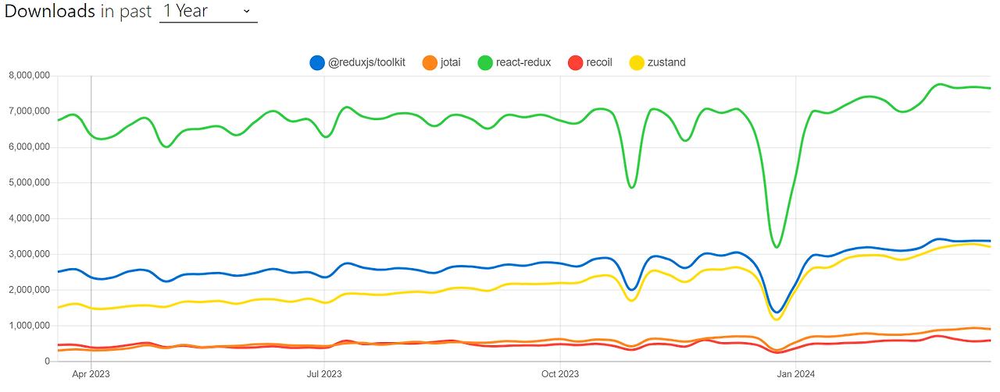
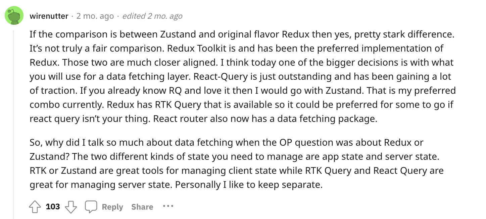

# 리액트와 상태관리

## FLUX 패턴
- View에서 사용자 인터랙션이 발생하면, Action이 생성
- Action은 Dispatcher로 전달
- Dispatcher는 Action을 Store로 전달
- Store는 Action을 처리하고, 상태를 업데이트한 후 View로 상태 변경 이벤트를 진행
- View는 상태 변경 이벤트를 수신하고, 새로운 상태로 리렌더링

# Redux vs Zustand

## Redux

### 서버 상태 관리
```jsx
// redux-thunk

export const fetchData = () => {
  return async (dispatch) => {
    dispatch({ type: 'FETCH_DATA_REQUEST' });
    try {
      const response = await fetch('/api/data');
      const data = await response.json();
      dispatch({ type: 'FETCH_DATA_SUCCESS', payload: data });
    } catch (error) {
      dispatch({ type: 'FETCH_DATA_FAILURE', error });
    }
  };
};
```

```jsx
// redux-saga

import { call, put, takeEvery } from 'redux-saga/effects';

function* fetchDataSaga() {
  try {
    const response = yield call(fetch, '/api/data');
    const data = yield response.json();
    yield put({ type: 'FETCH_DATA_SUCCESS', payload: data });
  } catch (error) {
    yield put({ type: 'FETCH_DATA_FAILURE', error });
  }
}

function* watchFetchData() {
  yield takeEvery('FETCH_DATA_REQUEST', fetchDataSaga);
}
```

- 코드의 길이가 크고, 초기 세팅 신경쓸게 많다.
- 서버 상태 관리 툴을 같이 쓰지 않는다면, 불필요한 패키지 용량을 많이 차지한다.
- 최근 Redux를 기존에 쓰던 프로젝트에서 Redux를 걷어내는 추세라고 한다.
- React Query 및 SWR와 같은 상태관리 라이브러리들이 서버상태를 캐싱하고 유용한 기능을 많이 제공해줘서, Redux의 효용성이 다소 떨어진다.

## Zustand
- 경량 상태 관리 라이브러리
- 간단한 API와 적은 보일러플레이트 코드
- 다양한 규모의 프로젝트에서 사용 가능.


1. 간단한 API
```jsx
import create from 'zustand';

// 상태 정의
const useStore = create(set => ({
  bears: 0,
  increasePopulation: () => set(state => ({ bears: state.bears + 1 })),
  removeAllBears: () => set({ bears: 0 })
}));

// 컴포넌트에서 상태 사용
function BearCounter() {
  const bears = useStore(state => state.bears);
  const increasePopulation = useStore(state => state.increasePopulation);

  return (
    <div>
      <h1>{bears} bears around here...</h1>
      <button onClick={increasePopulation}>Increase Population</button>
    </div>
  );
}
```
2. 상태의 모듈화
상태를 모듈화하여 관리한다 >> 상태가 복잡해지더라도 코드가 깔끔하게 유지될 수 있음


3. 미들웨어 지원
상태 관리에 필요한 다양한 미들웨어를 쉽게 통합할 수 있습니다. 예를 들어, 로깅이나 비동기 처리를 위해 미들웨어를 추가할 수 있습니다.

```jsx
export const logger = config => (set, get, api) => config(args => {
  console.log('  applying', args);
  set(args);
  console.log('  new state', get());
}, get, api);
```

```jsx
import create from 'zustand';
import { logger } from './logger';

const useStore = create(logger(set => ({
  bears: 0,
  increasePopulation: () => set(state => ({ bears: state.bears + 1 })),
  removeAllBears: () => set({ bears: 0 })
})));

```

4. React의 훅과의 호환성
5. 경량성 - 전체 라이브러리의 크기가 작아서 애플리케이션의 번들 크기를 크게 증가시키지 않는다

6. 부분적인 상태 구독 가능

Redux, Context API 와 달리, 컴포넌트 마다 부분적인 상태들만 구독함으로써, 모든 컴포넌트의 재랜더링이 일어나지 않고, 해당 상태를 구독하고 있는 컴포넌트만 리렌더링 할 수 있게 한다.

```jsx
import create from 'zustand';

const useStore = create(set => ({
  bears: 0,
  increasePopulation: () => set(state => ({ bears: state.bears + 1 })),
  fish: 0,
  increaseFish: () => set(state => ({ fish: state.fish + 1 }))
}));

function BearCounter() {
  const bears = useStore(state => state.bears);
  return <h1>{bears} bears around here...</h1>;
}

function FishCounter() {
  const fish = useStore(state => state.fish);
  return <h1>{fish} fish around here...</h1>;
}
```

7. 사용자 수



8. 번외
