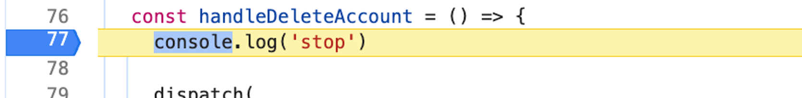
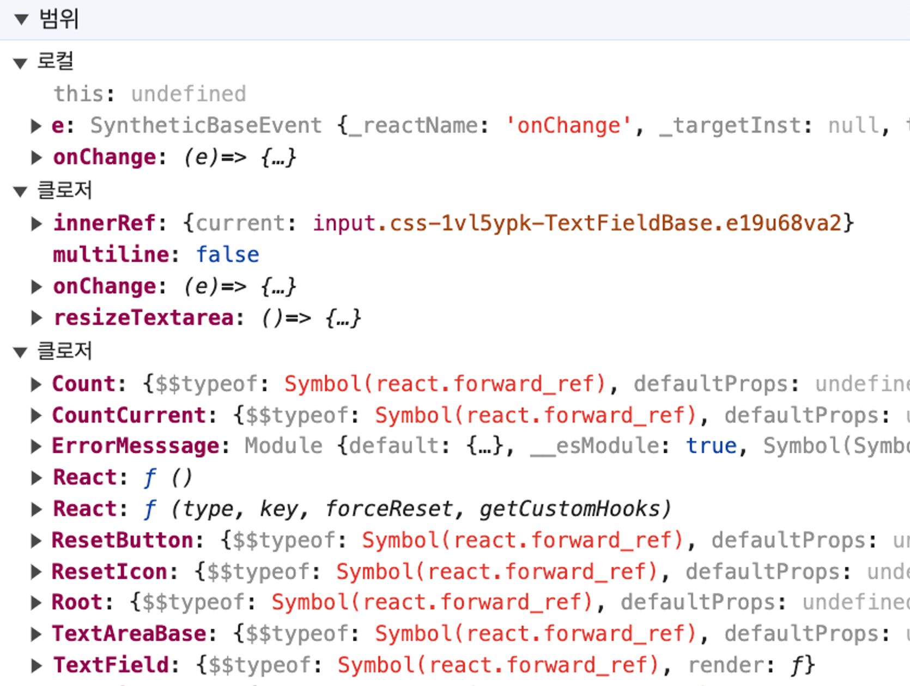
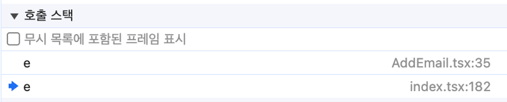
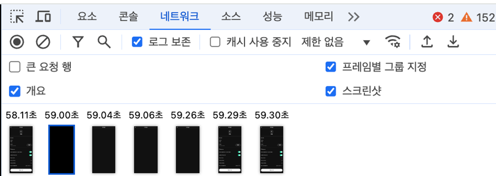
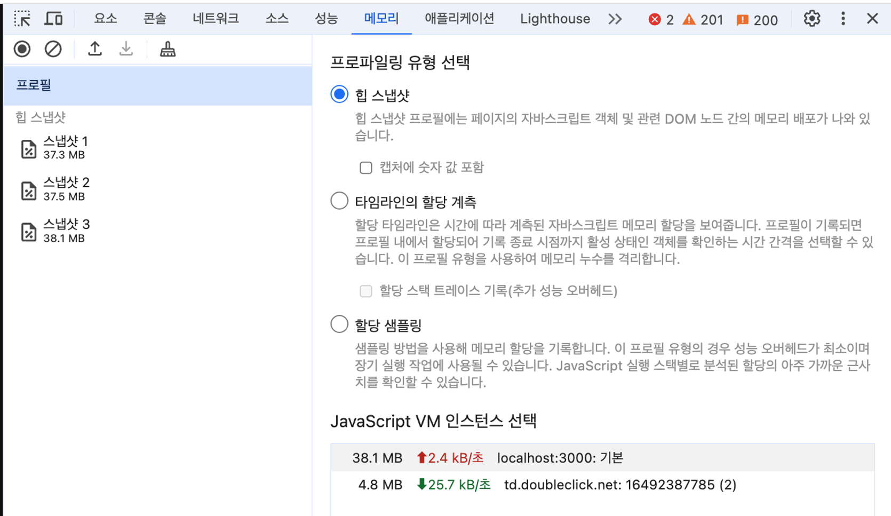
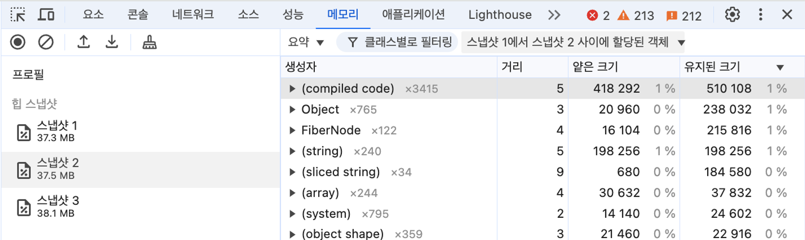
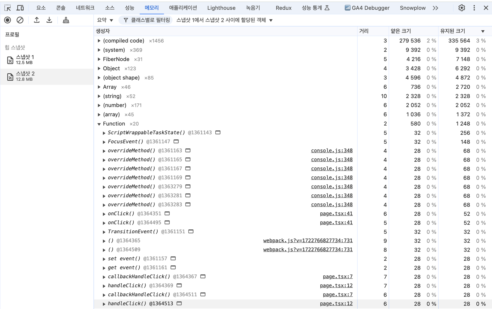

# 7장 크롬 개발자 도구를 활용한 애플리케이션 분석

### 요소

개발모드에서 리액트 코드를 수정해 핫 리로딩(hot reloading)을 거치지 않고 직접 DOM을 직접적으로 수정해볼수 있습니다.

### 소스

개발모드에서 사용시 실제 소스 코드까지 보여줍니다. 프로덕션인 경우 빌드과정에 압축하기 때문에 유용하지 않습니다.

중단점

실제 소스코드를 오염시키지 않고 중단점을 설정해서 디버깅을 할 수 있습니다



범위

현재 중단점에서의 스코프를 의미합니다. 로컬스코프, 클로저, 전역 스코프 등을 확인할 수 있습니다.


호출 스택

현대 중단점의 콜스택을 확인할 수 있습니다. 자바스크립트 코드가 실행되어 생성되는 실행 콘텍스트가 어떻게 저장되어 어떤 모습을 하고 있는지 볼 수 있습니다.



### 네트워크

모바일 웹페이지를 개발하는 것이라면 총 리소스의 크기만큼 사용자가 모바일 네트워크 비용을 지불해야 하므로 리소스 크기가 클 경우 gzip이나 brotli을 적절히 사용해 리소스 압축이 필요하다.

스크린숏 캡쳐 기능을 통해 네트워크 요청 흐름에 따라 웹페이지 로딩과정을 볼 수 있다.


네트워크 통해 집중적으로 살펴봐야 하는점은 아래와 같다

- 불필요한 요청 또는 중복되는 요청이 없는지
- 웹페이지 구성에 필요한 리소스 크기가 너무 크지 않는지
- 리소스를 불러오는 속도는 적절한지 또는 너무 속도거ㅏ 오래 걸리는 리소스는 없는지
- 리소스가 올바른 우선순위로 다운로드되어 페이지를 자연스럽게 만드는지

### 메모리

힙 스냅샵 기능을 통해 스냅샷 간 메모리를 점유하고 있는 데이터들을 볼 수 있습니다. 두 개 이상의 스냅샷을 촬영하여 그 차이만 비교하는 방식으로 디버깅 하는것이 훨씬 수월합니다.




음 useCallback을 사용했음에도 스냅샵 사이에 함수가 재생성됨..


```tsx
"use client";
import { container, hstack } from "@/styled-system/patterns";
import { Button } from "@/ui/button";
import { useCallback, useState } from "react";

const Test = ({ num }: { num: number }) => {
  const callbackHandleClick = () =>
    useCallback(() => {
      console.log(num);
    }, [num]);

  const handleClick = () => {
    console.log("click");
  };

  return (
    <>
      <Button onClick={handleClick}>Click me</Button>
      <Button onClick={callbackHandleClick}>Click me</Button>
    </>
  );
};

export default function Home() {
  const [toggle, setToggle] = useState(false);
  const handleToggle = () => {
    setToggle((prev) => !prev);
  };

  return (
    <div
      className={container({
        maxW: "500px",
        my: "24px",
      })}
    >
      <div
        className={hstack({
          w: "full",
          gap: "4",
        })}
      >
        <Test num={1} />
        <Button onClick={handleToggle}>{toggle ? "on" : "off"}</Button>
      </div>
    </div>
  );
}
```
