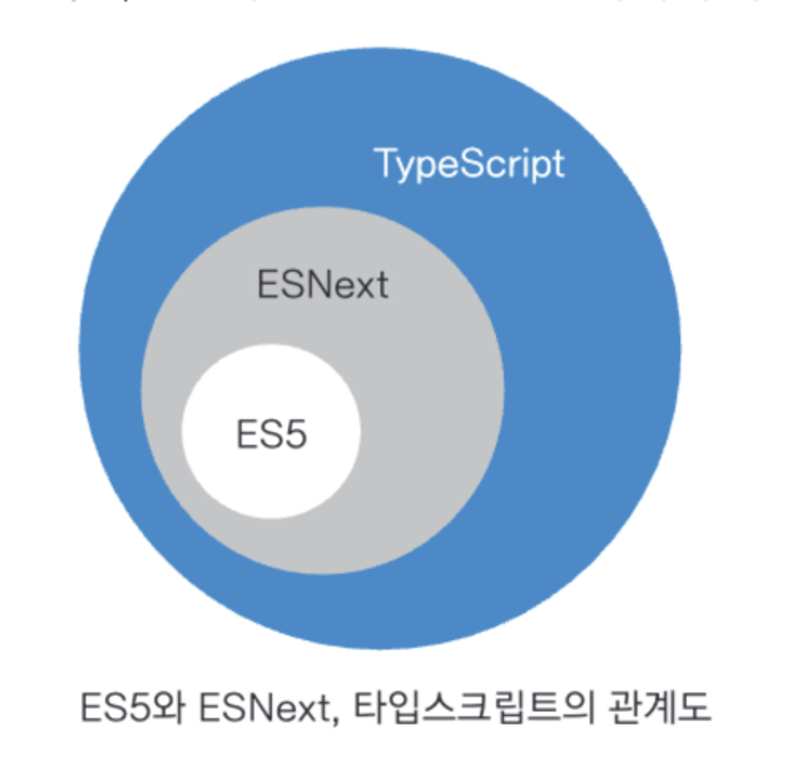

### creaet-react-app, create-next-app

리액트 애플리케이션을 만드는 보일러플레이트 CLI 도구

cra의 경우 리액트 팀에서 더이상 유지보수되지 않을 가능성이 크다.

### tsconfig.json

\*"$schema": "http://json.schemastore.org/tsconfig" 없어도 자동완성 잘됌
가능한 옵션들은 https://www.typescriptlang.org/tsconfig/ 에서 확인 가능합니다.

### ES5, ESNext, Typescript

먼저, ES5는 ECMAScript5의 줄임말로 웹 브라우저에서 동작하는 표준 자바스크립트입니다.

ESNext는 ES6 이후 버전을 통틀어 부르는 "새로운 자바스크립트"입니다.

ES6에 추가된 대표적인 문법으로는 const, arrow function, Promise, module(import, export), class등이 있습니다.

ES5(2009) → Typescript(2012, Microsoft) → ES6(2015)


### CI(Continuous Integration)

과거부터 젠킨스(Jenkins)가 꾸준히 사용됨

CI에 필요한 다양한 기능을 제공하지만 별도 서버 구축과, 서버 내 젠킨스 설치 및 사용중인 Github 저장소와 연결하는 작업 등 설치 및 유지보수가 번거로움

깃허브 액션은 깃허브 저장소를 기반으로 CI를 구축하고자 할 때 유용하게 사용가능하다.

프론트엔드 어플리케이션의 경우 서버로부터 응답을 연동하는 시나리오를 제외한다면 테스트, 빌드, 정적 분석 등 CI에 필요한 대부분의 기능을 저장소에 있는 코드만으로 쉽게 구현이 가능하다.

### 깃허브 액션

러너(runner): 러너란 파일로 작성된 깃허브 액션이 실행되는 서버이다. 특별히 지정하지 않으면 공용 깃허브 액션 서버를 이용하며, 별도의 러너를 구축해 자체적으로 운영할 수도 있다.

액션(action): 러너에서 실해오디는 하나의 작업 단위를 의미한다. yml 파일로 작성된 내용을 하나의 액션으로 볼 수 있다.

이벤트(event): 깃허브 액션의 실행을 일으키는 이벤트를 의미한다. 특정 브랜치 지정 등의 가능하다.

- pull_request, issues, push, schedule(특정 시간에 실행되는 이벤트)

잡(jobs): 하나의 러너에서 실행되는 여러 스텝의 모음을 의미한다. 하나의 액션에서 여러 잡을 생성할 수 있으며, 특별히 선언한 게 없으면 내부 가상머신에서 각 잡은 병렬로 실행된다.

스텝(steps): 잡 내부에서 일어나는 하나하나의 작업을 의미한다. 이 작업은 병렬로 일어나지 않는다.

스탭들을 엮어서 잡을 만들고, 이러한 여러개의 작업은 병렬로 실행되며, 이러한 잡을 하나 이상 모아둔 것을 액션이라고 한다. 그리고 그 액션을 실행하는 것이 러너이다.

### 유용한 액션과 깃허브 앱

- Lighthouse CI

\*package.json

dependencies, devDependencies 구분이 모호해지고 있음. 어떤 종속성으로 설치하던 node_modules에 동일하게 설치가 되고 실제로 서비스에 배포해야하는 라이브러리인지 결정은 번들러가 하게 됨. 그리고 복잡해진 개발 파이프라인으로 개발단계에서만 필요한 의존성들이 파이프라인 중간중간에도 필요해지면서 경계가 모호해짐. 단 npm 패키지로 업로드하는 경우에는 구분해야함

### 도커(Docker)

> “도커는 개발자가 모던 애플리케이션을 구축, 공유, 실행하는 것을 도와줄 수 있도록 설계된 플랫폼이다. 도커는 지루한 설정 과정을 대신해 주므로 코드를 작성하는 일에만 집중할 수 있다”

도커(Docker)는 애플리케이션을 빠르게 배포할 수 있도록 애플리케이션을 ‘컨테이너’라는 단위로 패키징하고, 이 ‘컨테이너’ 내부에서 어플리케이션이 실행될 수 있도록 도와준다. 도커는 이 ‘컨테이너’를 바탕으로 독립된 환경에서 애플리케이션이 항상 일관되게 실행할 수 있도록 도와준다.

\*쉽고 빠르게 배포하기 : Vercel, Netlify, AWS Amplify, DigitalOcean

### 도커 용어

이미지: 도커에서 이미지란 컨테이너를 만드는 데 사용되는 템플릿을 의미한다. 이 이미지를 만들기 위해서는 Dockerfile이 필요하며, 이 파일을 빌드하면 이미지를 만들 수 있다.

컨테이너: 도커의 이미지를 실행한 상태를 컨테이너라고 한다. 이 컨테이너가 바로 독립된 공간이며, 이미지가 목표하는 운영체제, 파일 시스템, 각종 자원 및 네트워크 등이 할당되어 실행될 수 있는 독립된 공간을 생성한다.

Dockerfile : 어떤 이미지 파일을 만들지 정의하는 파일

태그 : 이미지를 식별할 수 있는 레이블 값으로 일반적으로 이름:태그명 형태로 구성되어 있다.

리포지토리 : 이미지를 모아두는 저장소

레지스트리 : 리포지토리에 접근할 수 있게 해주는 서비스로 대표적으로 도커 허브(Docker Hub)가 있다. 이 리포지터리에서 사용자는 원하는 이미지를 내려받아서 사용한다.

리액트 어플리케이션을 도커라이즈하고, 이를 도커 허브에 푸시하고 이를 클라우드에서 실행하여 배포합니다. 이미지 저장소는 달라도 이미지를 업로드하기 위한 로그인 정보(credential)을 얻고, 해당 원격 이미지 저장소에 이름에 맞게 도커 이미지의 태그를 변경한다음 푸시하면 된다.

대부분의 기업에서는 애플리케이션을 도커라이즈해서 배포하고, 각 이미지를 관리하고 보관하면서 배포 관련 히스토리를 남겨두거나 롤백하는 용도로 사용합니다. 도커 이미지를 빌드한 이후의 배포하는 프로세느는 DevOps의 방향성, 사용하는 서비스별로 상이합니다.

책에서는 GCP를 사용하는데 AWS 사용할 시에는 아래와같은 순서대로 작업합니다.

1. Docker 이미지 만들기
2. AWS Elastic Container Registry (ECR)에 Docker 이미지 푸시
3. AWS Elastic Container Service (ECS)에서 애플리케이션 배포
   1. Route 53을 사용하여 도메인 설정
   2. AWS Certificate Manager를 사용하여 SSL 인증서 설정

Dockerfile 예시 :

```bash
# 베이스 이미지 설정
FROM node:16-alpine // 도커 이미지를 기반으로 이미지를 생성합니다. node.js 16 버전이 설치된 알파인 리눅스 운영체제

# 작업 디렉토리 설정
WORKDIR /app

# 패키지 설치 및 빌드
COPY package.json ./
COPY package-lock.json ./
RUN npm install

COPY . ./ // 빌드 전에 모든 리소스를 복사

# Next.js 빌드
RUN npm run build

# 포트 설정
EXPOSE 3000

# 애플리케이션 시작 명령어
CMD ["npm", "start"]

```
