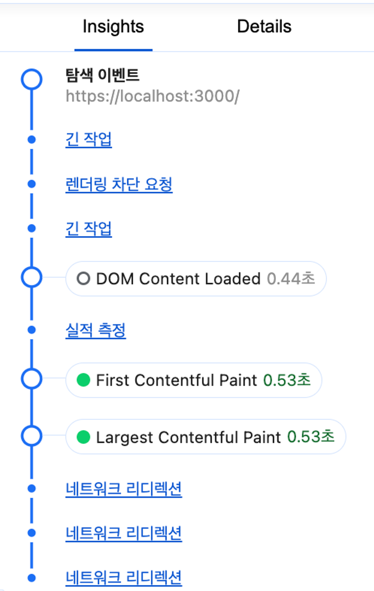

### LCP : Large Contentful Paint

페이지가 처음으로 로드를 시작한 시점부터 뷰포트 내부에서 가장 큰 이미지 또는 텍스트를 렌더링하는데 걸리는 시간

뷰포트 밖은 고려하지 않는다.

뷰포트 → 사용자에게 현재 노출되는 화면, 기기마다 다르다.

 \*성능 통계 리코딩

사용자가 페이지가 로드되었다고 인지하는 시점으로 DomContentLoaded Event 이후이다.

### What is. Large Content?

``

- `<svg>` 내부의 `<imgae>`

poster 속성을 사용하는 `<video>`

url()을 통해 불러온 배경 이미지가 있는 요소

텍스트와 같이 인라인 텍스트 요소를 포함하고 있는 블록 레벨 요소

LCP 최적화를 위한 조언

(1) `background-image` 보다는 `` 태그를 사용하자.

``, 이미지는 브라우저에 의해서 먼저 발견되어 빠르게 요청이 일어난다. 이는 HTML을 파싱하는 단계를 차단하지 않고 이미지와 같이 빠르게 미리 로딩하면 좋은 리소스를 먼저 찾아 로딩하는 브라우저의 프리로드 스캐너 기능이다. ``, `<picture>` 태그를 사용하게 되면 병렬적으로 리소스를 다운받게 된다.

CSS에 있는 리소스는 항상 느리다. 이러한 리소스들은 브라우저가 해당 리소스를 필요로 하는 DOM을 그릴 준비가 될 때까지 리소스 요청을 뒤로 미루기 때문이다.

(2) `<svg>` 내부 ``는 사용하지 말자.

위와 같은 병렬적인 이미지 리소스 다운로드가 불가능하다.

(3) `<video>`의 poster 역시 ``와 같은 성능

video가 LCP에 영향을 줄 거 같으면 poster를 반드시 넣어주자

\*그 외 조언

이미지 무손실 압축 : 웹으로 서비스할 이미지는 가능한 무손실 형식으로 압축해 최소한의 용량으로 서비스하는 것이 좋다.

loading=lazy는 리소스를 중요하지 않음으로 표시하고 필요할때만 로드하는 전략으로 LCP에 사용되는 이미지에는 적절하지 않다.

fadeIn등의 애니메이션을 적용하는 경우 그 만큼 LCP도 늦어진다.

useEffect에서 이미지 불러오는 코드 같은건 당연히 작성해서는 안된다.

LCP 리소스는 클라이언트에서 직접 호스팅하는게 적절하다. 이미지 최적화 서비스를 사용하더라도 결국 다른 origin에서 리소스를 다운받는것이 직접 호스팅하는 것보다 느리다.

### FID : First Input Delay

최초입력지연은 사용자가 얼마나 빠르게 웹페이지와의 상호작용에 대한 응답을 받을 수 있는 측정하는 지표입니다.

이 작업은 브라우저의 메인 스레드가 처리해야 하는 다른 작업이 많을수록 느리다.

당장의 로딩에 필요하지 않은 리소스는 리액트의 Suspense, lazy Next.js의 dynamic을 이용해 나중에 불러올 수 있다. ex) Modal, Toast

불필요한 폴리필은 넣지 않습니다

타사 자바스크립트 코드(GA, Firebase)의 경우 `<script>`에 async, defer 속성을 넣어서 지연 또는 병렬로 스크립트를 실행하도록 합니다.

광고와 같이 뷰포트 위치에 따라 불러와야 하는 컴포넌트의 경우 Intersection Observer를 활용해 뷰표트에 들어오는 시점에 불러오는 것이 좋습니다.

### CLS : Cumulative Layout Shift

웹페이지의 생명주기 동안 발생하는 예기치 않은 이동에 대한 지표를 계산하는 것. 지표가 낮을 수록, 즉 사용자가 겪는 예상치 못한 레이아웃 이동이 적을수록 좋은 웹사이트 이다.

누적 레이아웃 이동은 클라이언트에서 삽입되는 동적인 요소로 인해 발생한다. 갑자기 요소의 크기가 바뀌거나 광고가 갑자기 뜬다던가 하는 경우에 영향을 받는다.

스켈레톤 UI는 CLS를 위한 좋은 대책입니다. 동적으로 뜰것으로 예상되는 공간을 미리 확보해 두는 것이 가능합니다.

폰트 로딩 최적화

폰트는 레이아웃 이동을 일으키는 원인 중 하나다. 폰트는 각각 고유의 높이와 너비를 가지고 있어서 지정한 폰트가 다운로드 전에 텍스트를 노출하려고 한다면 높이와 크기가 다른 기본 폰트를 기반으로 한. 텍스트를 노출해서, 혹은 미처 텍스트를 노출하지 못해서 누적 레이아웃 이동이 일어날 수 있다.

`<link>`의 rel=preload를 사용하면 페이지에서 즉시 필요로 하는 리소스로 명시할 수 있다.

next/font, next/font/google 사용하자

- rel=’preload’ 자동으로 적용됩니다.
- 외부 요청 필요없이 자체 호스팅으로 구글이 제공하는 폰트 이용이 가능합니다.
- FOUT 현상이 발생하지 않습니다.
