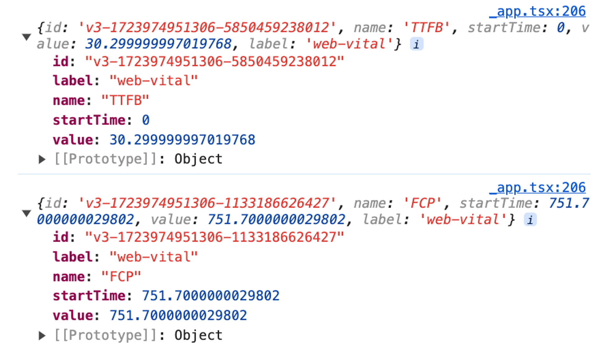
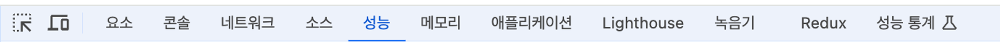
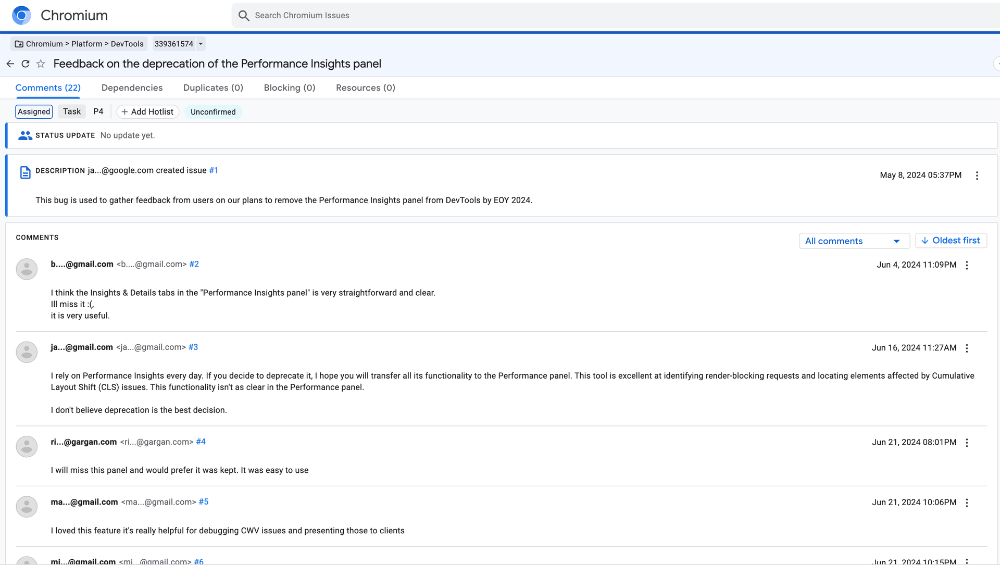
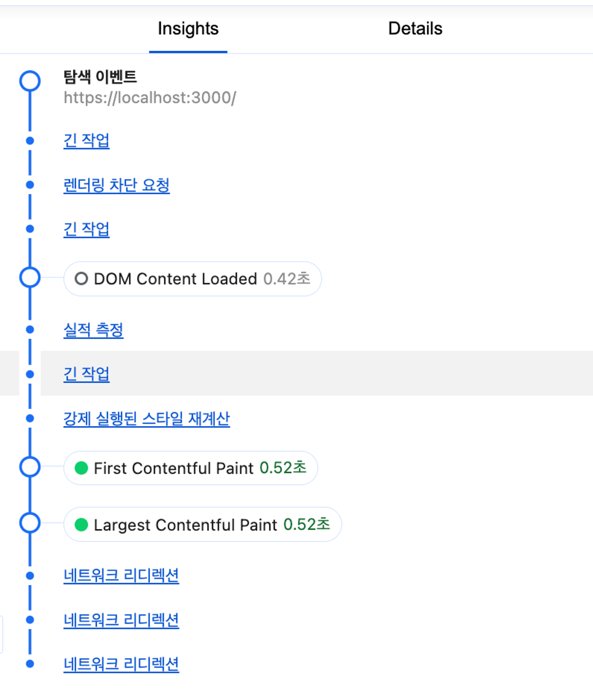

### 개발 중 직접 로깅하기

next.js를 사용중이라면 \_app.tsx에서 아래와 같이 함수를 작성하면 특정 이벤트마다 자동으로 콘솔 로그를 찍어줍니다.

```tsx
export function reportWebVitals(metric: NextWebVitalsMetric) {
  console.log(metric);
}
```



### 크롬 개발자 도구



- Lighthouse
- 성능 탭
- 성능 통계 탭 → 삭제 예정 좋은데 왜..?

삭제하지 말고 살려달라고 사람들이 외치는 중ㅋㅋㅋ


성능 통계 탭으로 페이지 로딩 성능 측정 해보겠습니다.


긴작업(Long Task) 확인

외부 라이브러리 종속 함수들이 대체로 오래 걸리는거 같네요…

Framer-motion, i18n 등등
