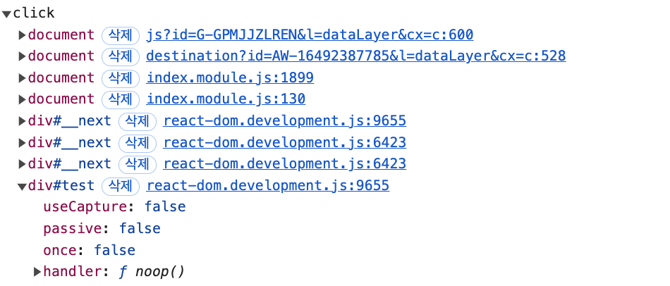

## React 17

### React 17부터는 점진적 업데이트가 가능합니다

16 > 17 버전 업그레이드에서는 유의적 버전 전략 기반으로 업데이트가 되어 새로운 주 버전이 릴리스되면 이전 버전에서의 API 제공이 중단되었지만 17 버전부터는 점진적인 업그레이드가 가능하도록 바뀌어서 버전 업데이트 이후에도 이전 버전의 기능을 함께 사용할 수 있습니다.

하지만 이는 차선책으로 하나의 리액트 버전을 사용하기 것이 좀 더 성능면에서 낫습니다. 또한 이러한 점진적 업데이트를 사용하기 위해서 적아도 17 버전까지의 마이그레이션이 필요합니다.

### React(nextjs) 이벤트 위임 동작 확인

실제 Dom에는 noop() 함수로 핸들러가 달리고 `div#__next`에 위임되어 있음. 해당 핸들러를 지우니 동작안함



```tsx
// _app.tsx

...
<div
  id='test'
  onClick={function test() {
    console.log('test');
  }}>
  <Layout {...props} />
</div>;
...
```

### 16 > 17 이벤트 위임 방식 변화

이전 버전에는 모든 이벤트가 최상단 객체인 document로 위임이 되었지만 17부터는 리액트 컴포넌트 최상단 트리인 루트요소로 변경되었다.

리액트 16에서는 모든 이벤트가 `document` 레벨에서 처리되기 때문에, 다른 라이브러리나 코드를 통해 `document`에 등록된 이벤트 핸들러가 리액트 이벤트보다 먼저 실행될 수 있습니다. 반면 리액트 17에서는 이벤트가 `root` 컨테이너에서 처리되기 때문에, 리액트 애플리케이션 내에서 이벤트 버블링 순서가 더 일관성 있게 유지됩니다.


babel transfiler 에서 import React 자동 삽입

ESLint에서 해당 옵션 비활성화

```jsx
module.exports = {
...

    "rules": {
      ...
    	"react/react-in-jsx-scope": "off",
      ...
    }

...

```

### useEffect 클린업 함수의 비동기 실행

16에서는 클린업 함수가 동기적으로 실행되기 때문에 클린업 함수가 완료되기 전가지는 다른 작업을 방해하므올 불필요한 성능저하가 있었지만 17 버전부터는 화며이 완전히 업데이트 된 이후에 클린업 함수가 비동기로 실행된다.

### 리액트 컴포넌트의 undefined 반환

16 : 에러, 하지만 forwardRef, memo에서 undefined를 반환하는 경우 에러가 발생하지 않는 버그

17 : 항상 에러

18 : 에러가 아니다. undefined도 엄연한 리액트 컴포넌트의 반환값이 될 수 있다. null을 반환하는게 낫지 않을까?
