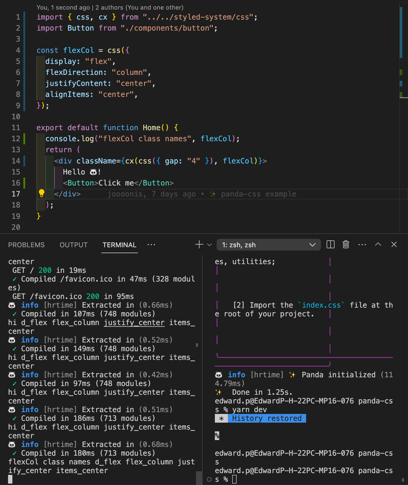
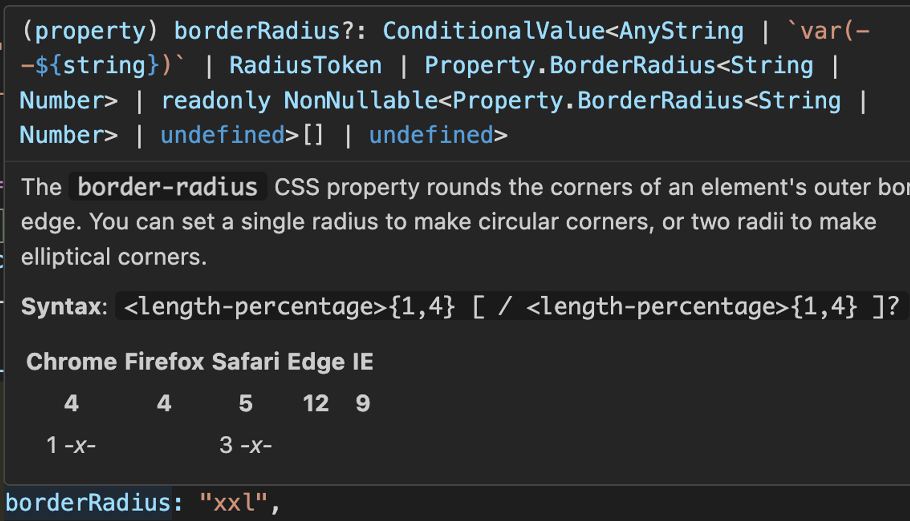

## panda-css 살펴보기

### atomic styling > css, cx

css 함수를 사용하면 atomic하게 css를 작성할 수 있습니다. css 함수는 styles을 인수로 받아서 string을 반환합니다. 콘솔을 찍어보면 미리 정의된 클래스 이름들이 출력되는걸 볼 수 있습니다. (\*서버 컴포넌트기 때문에 터미널에서 로깅됩니다)


스타일을 병합하려면 cx 함수를 사용하면 됩니다. cx 함수는 문자열들을 통합하는 panda에서 제공하는 유틸 함수 입니다.

```tsx
/* eslint-disable */
type Argument = string | boolean | null | undefined;

/** Conditionally join classNames into a single string */
export declare function cx(...args: Argument[]): string;
```

### design system > tokens

미리 정의된 디자인 토큰(타입)들을 활용하여 디자인 시스템을 적용할 수 있습니다. extend 하거나 아예 새롭게 작성이 가능합니다. colors, radii 토큰에 대한 디자인 시스템을 panda.config.ts에서 작성합니다. 이러한 토큰들은 각 css 속성에 알맞게 type-safe하게 사용이 가능합니다.

```tsx
import { defineConfig } from "@pandacss/dev";

export default defineConfig({
  preflight: true,

  include: [
    "./src/components/**/*.{ts,tsx,js,jsx}",
    "./src/app/**/*.{ts,tsx,js,jsx}",
  ],

  exclude: [],

  theme: {
    tokens: {
      colors: {
        primary: {
          100: { value: "#DCFCD4" },
          200: { value: "#B3F9AB" },
          300: { value: "#80EF7E" },
          400: { value: "#80EF7E" },
          500: { value: "#5CE067" },
          600: { value: "#20AF46" },
          700: { value: "#169243" },
          800: { value: "#169243" },
          900: { value: "#086139" },
        },
      },
      radii: {
        sm: { value: "4px" },
        md: { value: "8px" },
        lg: { value: "16px" },
        xl: { value: "24px" },
        xxl: { value: "32px" },
        full: { value: "9999px" },
      },
    },
  },

  outdir: "styled-system",
});
```

예를 들어 borderRaidus css 속성에는 RadiusToken을 값으로 사용할 수 있습니ㅏ.



### layout > patterns

미리 사전 정의된 레이아웃 스타일을 patterns이라 합니다. stack, hstack, vstack, wrap, flex, center 등등을 제공하며 필요에 따라 커스텀하여 작성할 수 있습니다.

```tsx
import { center, flex } from "@/styled-system/patterns";
import Button from "./components/button";

const flexCol = flex({
  // pattern도 css 함수와 동일하게 string을 반환합니다.
  direction: "column",
  justify: "center",
  align: "center",
  bg: "primary.300",
});

export default function Home() {
  return (
    <div className={flexCol}>
      Hello 🐼!
      <p
        className={center({
          bg: "primary.900",
          p: 36,
          m: 12,
          borderRadius: "xxl",
          color: "white",
          fontSize: 24,
        })}
      >
        Center
      </p>
    </div>
  );
}
```

css, patterns등을 사용할 때 인자를 받거나 conditioinal 하게 스타일링을 하고 싶으면 아래처럼 사용하면 될 거 같습니다. (좋은 예제는 아니고 그냥 참고용)

```tsx
"use client";

import { flex as flexBase } from "@/styled-system/patterns";

const flex = (diection: "row" | "col") =>
  flexBase({
    direction: diection,
    justify: "center",
    align: "center",
    bg: "primary.300",
  });

export default function Home() {
  return <div className={flex("col")}>Hello 🐼!</div>;
}
```
