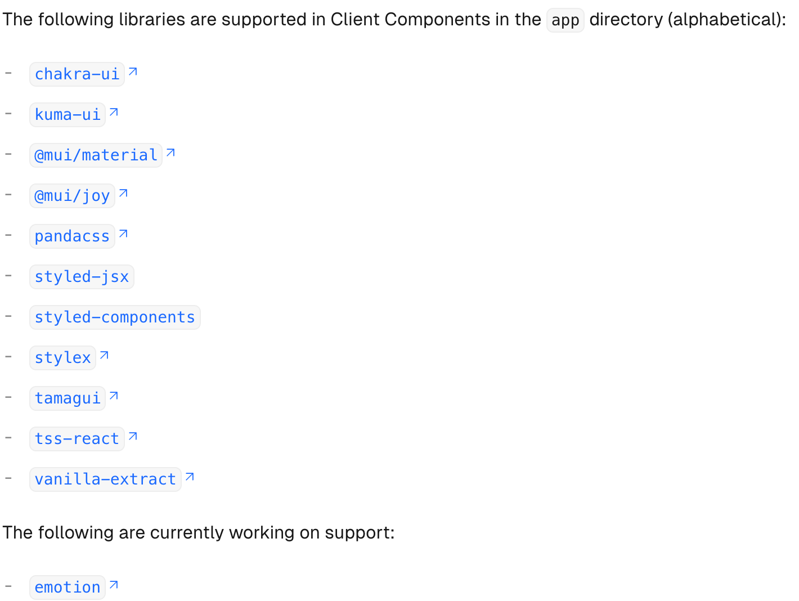

### App Router

next.js 13 버전부터 추가된 app router에서 모든 React 컴포넌트는 기본적으로 Server Component로 렌더링 됩니다. Client Component를 사용하기 위해서는 “use client” 주석을 상단에 추가해야 하며 Client Component에서는 클라이언트 사이드에세 제공하는 React hook, event handler, browser API 등의 사용이 가능합니다. 스타일링 기법 중 하나인 CSS-in-js는 클라이언트 사이드에서 동작하므로 기본적으로 Server Component에 대한 지원이 되지 않았습니다. 아래에서는 기존의 CSS-in-js 라이브러리를 Client Component에서 사용하는 방법과 Server Component를 지원하기 위해 등장한 zero-rumtime CSS-in-js 기술인 [vanila-extract](https://vanilla-extract.style/), [panda-css](https://panda-css.com/) 을 알아보겠습니다.

### styling

대부분의 CSS-in-js 라이브러리는 Server Component를 지원하지 않기 때문에 Client Component에서만 사용이 가능합니다. 아래에서는 Next.js 14 버전에서 기존의 CSS-in-js 라이브러리를 도입해보도록 하고 이후 Server Component를 지원하는 CSS-in-js 라이브러리를 사용해보도록 하겠습니다.

참고 : https://nextjs.org/docs/app/building-your-application/styling/css-in-js

### emotion

공식적으로는 Next.js app router을 지원하고 있지 않습니다. 하지만 runtime에 동작하는 CSS-in-js 라이브러리 특성상 Server Component를 지원하는 것은 이후에도 어려워 보입니다. 예로 Chakra UI는 내부적으로 쓰이는 emotion 코드를 zero runtime CSS-in-Js 라이브러리인 Panda로 교체하고 있습니다.


emotion 레포 내 관련 이슈 :

- https://github.com/emotion-js/emotion/issues/2978
- https://github.com/emotion-js/emotion/issues/2928

CSS-in-js 라이브러리를 Client Component에서 사용하려면 아래 순서대로 configuation 작업이 필요합니다.

1. A **style registry** to collect all CSS rules in a render.
2. The new `useServerInsertedHTML` hook to inject rules before any content that might use them.
3. A Client Component that wraps your app with the style registry during initial server-side rendering.

next.js 14 버전에서 emotion 라이브러리를 적용해보겠습니다. ([이슈에서](https://github.com/emotion-js/emotion/issues/2928#issuecomment-1293012737) configrtation 방법 참고)

```json
// pacakage.json 의존성 설치
{
	...
	"@emotion/react": "^11.11.4",
	"@emotion/styled": "^11.11.5",
	"next": "14.2.4",
}
```

```tsx
// app/registry.tsx

"use client";
import createCache from "@emotion/cache";
import { CacheProvider } from "@emotion/react";
import { useServerInsertedHTML } from "next/navigation";
import { useState } from "react";

export default function RootStyleRegistry({
  children,
}: {
  children: JSX.Element;
}) {
  const [cache] = useState(() => {
    const cache = createCache({ key: "css" });
    cache.compat = true;
    return cache;
  });

  useServerInsertedHTML(() => {
    return (
      <style
        data-emotion={`${cache.key} ${Object.keys(cache.inserted).join(" ")}`}
        dangerouslySetInnerHTML={{
          __html: Object.values(cache.inserted).join(" "),
        }}
      />
    );
  });

  return <CacheProvider value={cache}>{children}</CacheProvider>;
}
```

```tsx
// app/layout.tsx
"use client";

import RootStyleRegistry from "./registry";

export default function RootLayout({ children }: { children: JSX.Element }) {
  return (
    <html>
      <head></head>
      <body>
        <RootStyleRegistry>{children}</RootStyleRegistry>
      </body>
    </html>
  );
}
```

```tsx
// app/page.tsx

"use client";
/** @jsxImportSource @emotion/react */
import { css } from "@emotion/react";

const style = css`
  color: #fff;
  background-color: tomato;
`;

export default function Page() {
  return <div css={style}>something wrong</div>;
}
```

참고로 css prop 사용시에 /\*_ @jsxImportSource @emotion/react _/ 주석을 제거하고 싶으면 babel을 트랜스파일러로 사용해야 하는데(next.js 14에서는 [swc](https://www.notion.so/9-17-18-7ddbda9b043b43bba6c8aff730cd624c?pvs=21)를 사용) 따라오는 버그가 많아서 제거하지 못했습니다.

아래와 같이 styled 함수를 사용하여도 됩니다.

```tsx
"use client";

import styled from "@emotion/styled";

const Green = styled.div`
  display: flex;
  justify-content: center;
  align-items: center;
  color: #fff;
  background-color: green;
  padding: 20px;
`;

export default function Page() {
  return <Green>green</Green>;
}
```

하지만 여전히 Client Component에서만 스타일링이 가능하다는 건 큰 제약입니다. 이에 대한 대안으로 zero-runtime CSS-in-js 라이브러리인 [vanila-extract](https://vanilla-extract.style/), [panda-css](https://panda-css.com/) 가 있는데 두 라이브러리 모두 런타임이 아닌 빌드타임에 css를 정적으로 생성하여 런타임 오버헤드가 없습니다, 또한 스타일 작성시 타입스크립트를 사용하여 type-safe 하다는 장점이 있습니다. 만약 App Router를 사용해서 프로젝트를 한다면 둘 중 하나를 사용하여 Server Component에서의 스타일링 제약이 없도록 하는 것이 좋은 선택입니다.

### panda-css

https://panda-css.com/docs/installation/nextjs 를 따라서 세팅합니다.

```bash
yarn add -D @pandacss/dev
yarn panda init --postcss
```

```bash
error postcss-merge-rules@7.0.0: The engine "node" is incompatible with this module. Expected version "^18.12.0 || ^20.9.0 || >=22.0". Got "21.1.0"
```

node 버전 호환성에 문제가 있다고 합니다. nvm을 사용하여 알맞은 node 버전을 사용하도록 수정합니다.

```bash
nvm install 22.0.0
nvm use 22.0.0
```

`panda.config.ts` 에서 include, outdir을 설정합니다. outdir 이름은 원하는대로 수정할 수 있습니다. outdir 수정시 .gitignore에 경로를 수정해줍니다.

```tsx
// panda.config.ts
import { defineConfig } from "@pandacss/dev";

export default defineConfig({
  // Whether to use css reset
  preflight: true,

  // Where to look for your css declarations
  include: [
    "./src/components/**/*.{ts,tsx,js,jsx}",
    "./src/app/**/*.{ts,tsx,js,jsx}",
  ],

  // Files to exclude
  exclude: [],

  // Useful for theme customization
  theme: {
    extend: {},
  },

  // The output directory for your css system
  outdir: "styled-system",
});
```

스타일링이 작동합니다. Home은 현재 Server Component 임에도 스타일링이 잘 입혀집니다.

```tsx
// src/app/page.tsx

import { css } from "../../styled-system/css";

export default function Home() {
  return (
    <div
      className={css({
        fontSize: "2xl",
        fontWeight: "bold",
        color: "white",
        background: "tomato",
      })}
    >
      Hello 🐼!
    </div>
  );
}
```

### Repos :

- https://github.com/joooonis/panda-css-nextjs
- https://github.com/joooonis/styled-emotion-nextjs
