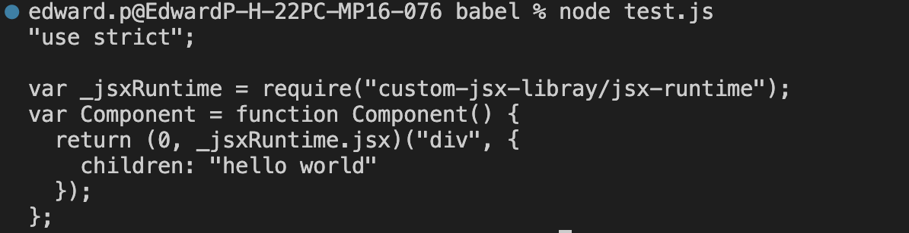

## 리액트 핵심 요소

### JSX

JSX는 아래 4가지 컴포넌트를 기반으로 구성되어 있습니다.

- JSXElement
- JSXAttributes
- JSXChildren
- JSXStrings

위 요소 중 JSXElement가 되기 위해서는 아래 세가지 중 한 형태여야 합니다.

```tsx
<JSXElement JSXAttribuets(optional)><JSXElement/>,

<JSXElement JSXAttribuets(optional) />

<>JSXChildren(optional)</>
```

React 에서 JXS 문법으로 작성시 통상적으로 아래와 같이 작성하는데
`<Child attribute={<div>hello</div>} />` 에서 컴포넌트를 {}로 감싸는 것은 문법적인 오류가 아니라 prettier의 규칙입니다.

```tsx
// invalid 하다고 헷갈리기 쉬운 valid 한 JSX 구문
<Child attribute=<div>hello</div> />
<>{(()⇒’foo’)()}</>
```

```tsx
// 유효한 JSX 구문이지만 React에서는 거의 사용하지 않음
<A.B><A.B/>
<A.B.C><A.B.C/>
<A:B></A:B>

<$><$/>
<_><_/>
```

## babel JSX 변환 실습

책에서 소개한 대로 babel은 React에서 JSX 문법으로 작성된 코드를 자바스크립트 코드로 트랜스파일링(변환)시켜 줍니다. 실제로 트랜스파일링이 어떻게 동작하는지 책의 예제를 따라서 실습해보겠습니다.

```json
// package.json
{
  "dependencies": {
    "@babel/core": "^7.24.7",
    "@babel/plugin-transform-react-jsx": "^7.24.7",
    "@babel/preset-env": "^7.24.7"
  }
}
```

```jsx
// test.js
// 리액트 17, 바벨 7.9.0 이후 추가된 자동 런타임(automatic runtime)으로 트랜스파일링 한 결과
"use strict";

const babel = require("@babel/core");

const SOURCE_CODE = `const Component = () => <div>hello world</div>;`;
const BABEL_CONFIG = {
  presets: ["@babel/preset-env"],
  plugins: [
    [
      "@babel/plugin-transform-react-jsx",
      {
        throwIfNamespace: false,
        runtime: "automatic",
        importSource: "custom-jsx-libray",
      },
    ],
  ],
};

babel.transform(SOURCE_CODE, BABEL_CONFIG, function (err, result) {
  if (err) {
    console.error(err);
  } else {
    console.log(result.code);
  }
});
```

console.log가 터미널에 아래와 같이 기록됩니다.  


ChatGPT의 도움을 받아서 좀 더 실습 진행해보겠습니다.

매번 콘솔을 찍기 귀찮으므로 babel/cli 등을 포함한 의존성을 추가적으로 설치합니다

```bash
yarn add @babel/core @babel/preset-env @babel/plugin-transform-react-jsx @babel/cli
```

.babelrc 에서 현재 Node.js의 현재 버전을 타겟으로 설정합니다.

```bash
// .babelrc
{
  "presets": [
    [
      "@babel/preset-env",
      {
        "targets": {
          "node": "current"
        }
      }
    ]
  ],
  "plugins": [
    [
      "@babel/plugin-transform-react-jsx",
      {
        "throwIfNamespace": false,
        "runtime": "automatic",
        "importSource": "custom-jsx-libray"
      }
    ]
  ]
}

```

트랜스파일링 전

```jsx
// example.js
const Component = () => <div>hello world</div>;
```

Babel CLI를 사용한 변환

```bash
npx babel example.js --out-file compiled.js
```

트랜스파일링 된 compiled.js

```jsx
"use strict";

var _jsxRuntime = require("custom-jsx-libray/jsx-runtime");
// example.js
const Component = () =>
  (0, _jsxRuntime.jsx)("div", {
    children: "hello world",
  });
```

## React.createElement 사용 예제

babel 7.9.0 버전 이전에는 `_jsxRuntime.jsx` 대신 `React.createElement`가 사용되었다고 합니다. `React.createElement`를 직접 사용하는 경우 트랜스파일링이 어떻게 동작하는지 실습해보겠습니다.

react 의존성에 추가

```json
{
  "dependencies": {
    "@babel/cli": "^7.24.7",
    "@babel/core": "^7.24.7",
    "@babel/plugin-transform-react-jsx": "^7.24.7",
    "@babel/preset-env": "^7.24.7",
    "react": "^18.3.1"
  }
}
```

props에 따라 다른 element를 렌더링하는 예제 example2.js

```jsx
function TextOrHeading({ text, heading }) {
  return heading ? <h1 className="text">{text}</h1> : <p>{text}</p>;
}

function TextOrHeading2({ text, heading }) {
  return React.createElement(heading ? "h1" : "p", { className: "text" }, text);
}
```

트랜스파일링 결과 compiled.js

`React.createElement`으로 작성한 JSX는 변환 이후에도 동일하게 `React.createElement`를 사용합니다. 따라서 위의 코드는 `React.createElement`를 직접 사용하는 방식으로 리펙토링이 가능합니다.

```jsx
"use strict";

var _jsxRuntime = require("custom-jsx-libray/jsx-runtime");
function TextOrHeading({ text, heading }) {
  return heading
    ? (0, _jsxRuntime.jsx)("h1", {
        className: "text",
        children: text,
      })
    : (0, _jsxRuntime.jsx)("p", {
        children: text,
      });
}
function TextOrHeading2({ text, heading }) {
  return React.createElement(
    heading ? "h1" : "p",
    {
      className: "text",
    },
    text
  );
}
```

babel 7.9.0 이전 버전에서는 항상 `React.createElement` 를 사용하도록 트랜스파일링 된다고 하는데 한번 확인해보겠습니다.

@babel/preset-react 의존성 추가

```json
{
  "dependencies": {
    "@babel/cli": "^7.24.7",
    "@babel/core": "7.8.0",
    "@babel/plugin-transform-react-jsx": "7.8.0",
    "@babel/preset-react": "7.8.0",
    "react": "^17.3.1"
  }
}
```

.babelrc 파일 수정

@babel/preset-env 을 사용하면 에러가 납니다. \*7.9.0 버전부터 사용되는것으로 보입니다.

```json
{
  "presets": ["@babel/preset-react"]
}
```

동일한 파일을 트랜스파일링하면 아래처럼 `React.createElement`을 사용하는 것을 확인 할 수 있습니다.

```jsx
"use strict";

function TextOrHeading(_ref) {
  var text = _ref.text,
    heading = _ref.heading;
  return heading
    ? /*#__PURE__*/ React.createElement(
        "h1",
        {
          className: "text",
        },
        text
      )
    : /*#__PURE__*/ React.createElement("p", null, text);
}
function TextOrHeading2(_ref2) {
  var text = _ref2.text,
    heading = _ref2.heading;
  return React.createElement(
    heading ? "h1" : "p",
    {
      className: "text",
    },
    text
  );
}
```

### 추가적인 정보

\*React에서 가상 DOM을 조작하는 방식이 일반적인 DOM을 조작하는 브라우저보다 빠르다?

무조건 빠른 것이 아니라 래익트의 이 가상 DOM 방식은 대부분의 상황에서 웬만한 에플리케이션을 만들 수 있을 정도로 충분히 빠르다

DOM을 수동으로 하나하나 변경해야 한다면 어떤 값이 바뀌었는지, 또 그 값에 따라 어떠한값이 변경됐고 이와 관련된 것들이 무엇이었는지 파악하기 어려우므로 리액트 내부의 파이버와 재조정자가 내부적인 알고리즘을 통해 관리해 줌으로써 대규모의 웹 어플리케이션을 효율적으로 유지보수하고 관리할 수 있게 한다.

리액트 파이버

- 리액트 파이버는 일반적인 자바스크립트 객체이다
- 리액트 컴포넌트에 대한 정보를 1:1로 가지고 있으며 비동기로 작업이 이루어진다.
- 작업을 작은 단위로 분할하고 쪼갠 다음, 우선순위를 매긴다
- 이러한 작업을 일시 중지하고 나중에 다시 시작하거나 필요하지 않은 경우 폐기할 수 있다.
- 처음 렌더링시에 파이버를 구성하고 가급적이면 재사용한다

리액트 파이버 트리

- 리액트에서 파이버 트리는 현재 모습을 담은 파이버 트리와 작업 중인 상태를 나타내는 workInProgress 트리 두가지가 존재한다
- 리액트 파이버의 작업이 끝나면 리액트는 단순히 포인터만 변경해서 두 트리를 변경한다. 이러한 기술을 더블 버퍼링 이라고 한다.
- 더블 버퍼링은 커밋단계에서 실행된다.

클래스형 컴포넌트 vs 함수형 컴포넌트

생명주기 메서드의 부재

useEffect는 생명주기를 위한 훅이 아니다 컴포넌트의 state를 활용해 동기적으로 부수 효과를 만드는 메커니즘이다.

렌더링이란

브라우저 : HTML과 CSS 리소스를 기반으로 웹페이지에 필요한 UI를 그리는 과정

리액트 : 브라우저가 렌더링에 필요한 DOM 트리를 만드는 작업

리액트에서 렌더링이 일어나는 이유

- 최초 렌더링
- 리렌더링
  - useState의 setter로 state가 변경
  - useReducer의 disptach가 실행
  - 컴포넌트의 key props가 변경
  - props가 변경되는 경우
  - 부모 컴포넌트가 렌더링 되는 경우
    - 부모 컴포넌트가 리렌더링된다면 자식 컴포넌트도 무조건 리렌더링이 일어난다

렌더와 커밋 단계

렌더단계(Render Phase)는 컴포넌트를 렌더링하고 변경 사항을 계산하는 모든 작업을 말한다.

커밋단계(Commit Phase)는 렌더 단계의 변경 사항을 실제 DOM에 적용해 사용자에게 보여주는 과정을 말한다. 이 단계가 끝나야 비로소 브라우저의 렌더링이 발생한다.

리액트의 렌더링이 일어난다고 해서 무조건 DOM 업데이트가 일어나는 것은 아니다. 렌더링을 수행했으나 커밋 단계까지 갈 필요가 없다면, 즉 변경사항을 계산했는데 아무 변경 사항이 감지되지 않는다면 커밋단계는 생략될 수 있다.

부모 컴포넌트의 렌더링으로 인한 자식컴포넌트의 리렌더링은 [memo](https://react.dev/reference/react/memo)(Usage : Skipping re-rendering when props are unchanged)로 컴포넌트를 감싸면 방지할 수 있는데(자식 컴포넌트의 props는 변경되지 않은 경우) 위에서 언급한대로 렌더 단계에서 변경사항이 감지되지 않아서 커밋단계가 생략되는 것이다.

useMemo에서 [비싼 연산인지 확인하는 방법](https://react.dev/reference/react/memo)

\*전체적으로 기록된 시간이 클 때(예시: `1ms` 이상) 해당 계산을 메모해 두는 것이 좋습니다.

```jsx
console.time("filter array");
const visibleTodos = useMemo(() => {
  return filterTodos(todos, tab); // todo와 tab이 변경되지 않은 경우 건너뜁니다.
}, [todos, tab]);
console.timeEnd("filter array");
```
