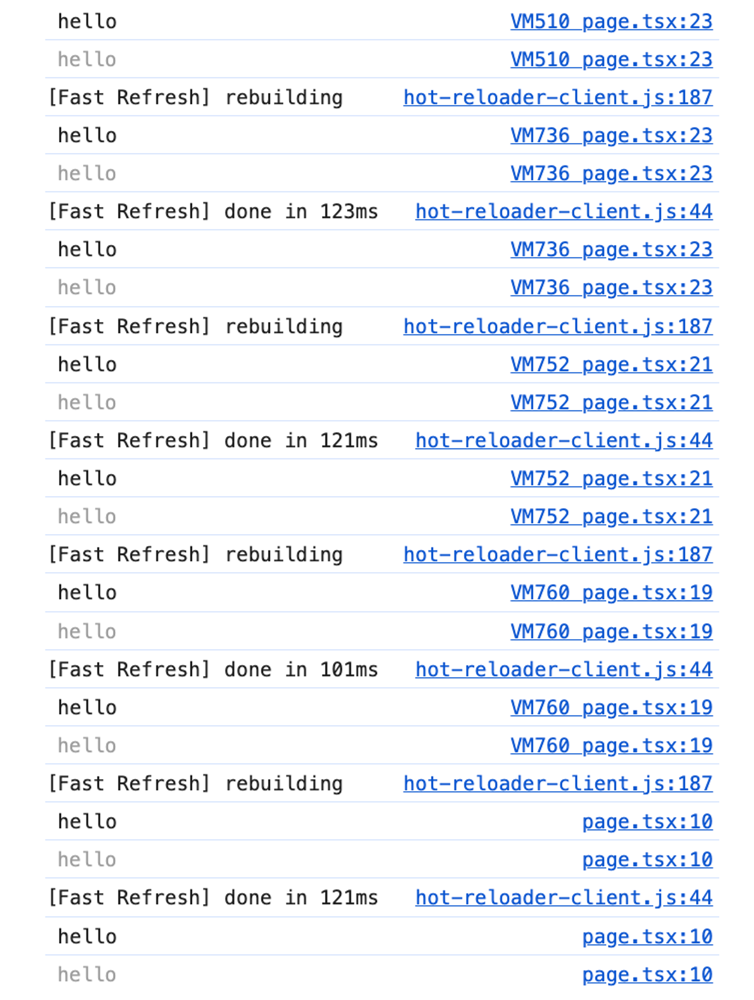
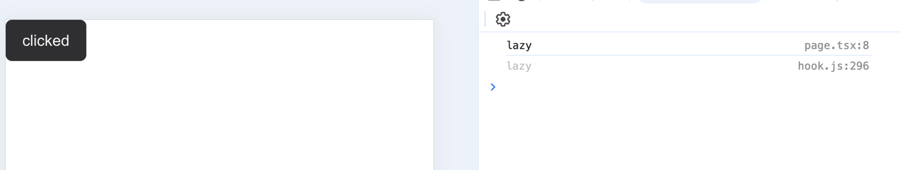
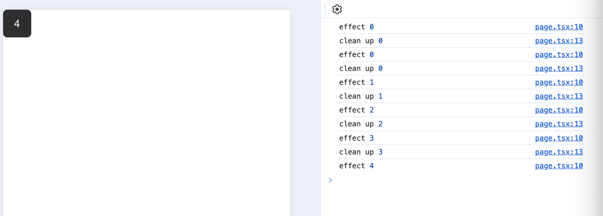
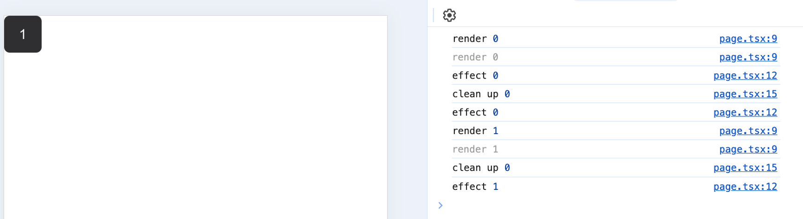

### useState

useState가 아닌 일반 변수를 사용하면 리렌더링이 일어나지 않는 이유

→ React의 함수형 컴포넌트는 매번 함수를 실행해 렌더링이 일어나는데 이때마다 함수 내부의 값들은 초기화가 되기 때문에 그 변경을 감지하지 못하기 때문입니다.

매번 렌더링이 발생될 때마다 함수는 새롭게 실행되고, 새롭게 실행되는 함수에서 state는 ‘hello’로 매번 초기화 됩니다. 떠라서 아무리 state를 변경해도 다시 hello로 초기화됩니다.

버튼을 눌러도 리렌더링이 일어나지 않기 때문에 console.log에는 hello만 출력됩니다.

```tsx
"use client";

import { Button } from "@/ui/button";
import { useState } from "react";

export default function Home() {
  const [, trigger] = useState();

  let state = " hello";
  console.log(state);

  return (
    <div>
      <Button
        onClick={() => {
          state = "world";
          trigger();
        }}
      >
        {state}
      </Button>
    </div>
  );
}
```



useState는 내부적으로 클로저를 사용해서 이를 해결합니다. 클로저는 어떤 함수(useState) 내부에 선언된 함수의 실행이 종료된 이후에도(useState가 호출된 이후에도) 지역변수인 state를 계속 참조할 수 있다는 것을 의미합니다.

함수형 컴포넌트 환경에서 state의 값을 유지하고 사용하기 위해서 리액트는 클로저를 활용하고 함수의 실행이 끝났음에도 함수가 선언된 환경을 기억할 수 있습니다.

### 게으른 초기화

useState의 기본값에 함수를 인수로 넣어주는것을 게으른 초기화(lazy initialization)이라고 하며 초기값이 복잡하거나 무거운 연산을 포함하고 있을때 사용하라고 공식문서에서 가이드하고 있습니다. 이 게으른 초기화 함수는 오로지 state가 처음 만들어질 때만 사용되고, 이후 리렌더링에서는 무시됩니다.

\*버튼을 클릭해서 리렌더링을 유발해도 초기화 함수는 실행되지 않습니다.

```jsx
export default function Home() {
  const [lazy, setLazy] = useState(() => {
    console.log("lazy");
    return "lazy";
  });

  return (
    <div>
      <Button onClick={() => setLazy("clicked")}>{lazy}</Button>
    </div>
  );
}
```


게으른 최적화는 localStorage, sessionStorage에 대한 접근, map, filter, find와 같은 배열에 대한 접근 등과 같이 무거운 연산을 포함해 실행 비용이 많이 드는 경우에 사용하면 좋다.

### useEffect

useEffect는 어플리케이션 내 컴포넌트의 여러 값들을 활용해 동기적으로 부수효과를 만드는 메커니즘입니다.

다음과 같은 함수형 컴포넌트가 있다고 할 때

```tsx
export default function Home() {
  const [counter, setCounter] = useState(0);
  return (
    <div>
      <Button onClick={() => setCounter(counter + 1)}>{counter}</Button>
    </div>
  );
}
```

버튼을 클릭하면 이 함수형 컴포넌트는 다음과 같이 다음 렌더링때 반환 됩니다.

```jsx
export default function Home() {
  const counter = 1;
  return (
    <div>
      <Button onClick={() => setCounter(counter + 1)}>{counter}</Button>
    </div>
  );
}
```

함수형 컴포넌트는 렌더링 시마다 고유의 state와 props값을 가지고 있고 useEffect는 렌더링할 때마다 의존성에 있는 값을 보면서 의존성의 값이 이전과 다른게 하나라도 있으면 콜백 함수를 실행합니다.

```jsx
export default function Home() {
  const counter = 1;

  useEffect(() => {
    console.log(counter);
  });

  return (
    <div>
      <Button onClick={() => setCounter(counter + 1)}>{counter}</Button>
    </div>
  );
}
```

**클린업 함수는 언제 실행되는가?**

클린업 함수 컴포넌트가 리렌더링이 일어날때 useEffect의 의존성 배열의 값에 변화가 있다면 그 이전의 값을 바라보면서 실행됩니다.

```jsx
1. 렌더링
2. 이전 값을 바라보면서 clean up 실행
3. 이번 렌더링의 값을 참조하여 useEffect callback 실행
```

즉 렌더링 > clean up > effect 의 순서대로 일어납니다.

```tsx
export default function Home() {
  const [counter, setCounter] = useState(0);

  useEffect(() => {
    console.log("effect", counter);

    return () => {
      console.log("clean up", counter);
    };
  }, [counter]);

  return (
    <div>
      <Button onClick={() => setCounter(counter + 1)}>{counter}</Button>
    </div>
  );
}
```



아래와 같이 작성하면?

```tsx
export default function Home() {
  const [counter, setCounter] = useState(0);

  console.log("render", counter); // 렌더링 도중에 일어남

  useEffect(() => {
    console.log("effect", counter); // 렌더링 완료된 이후에 실행

    return () => {
      console.log("clean up", counter); // effect callback 직전 이전 렌더링 값을 바라보면서 실행
    };
  }, [counter]);

  return (
    <div>
      <Button onClick={() => setCounter(counter + 1)}>{counter}</Button>
    </div>
  );
}
```



### 의존성 배열

```tsx
export default function Home() {
  const [counter, setCounter] = useState(0);

  console.log("rendering"); // 렌더링 도중에 실행

  useEffect(() => {
    console.log("rendered"); // useEffect는 렌더링 완료된 이후에 실행
  });

  useEffect(() => {
    console.log("mounted"); // 빈배열인 경우 최초 1회 마운트시에만 실행
  }, []);

  return (
    <div>
      <Button onClick={() => setCounter(counter + 1)}>{counter}</Button>
    </div>
  );
}
```

useEffect로 작성하는 경우 클라이언트 사이드에서 실행되는 것을 보장할 수 있고, 컴포넌트 렌더링 완료된 이후에 실행되어 side effect(부수효과)를 일으킨다

\*useEffect 사용시에 주의할 점

**eslint-disable-line react-hooks/exhausitive-deps 주석은 최대한 자제하라**

의존성 배열을 빈 배열로 하려다가 무한루프에 걸리기 쉽상이다. 실제로 그랬다. 빈 배열을 넘기기 전에 useEffect의 부수효과가 컴포넌트의 상태와 별개로 적동해야만 하는지, 혹은 여기서 호출되는게 최선인지 한 번 더 검토해 봐야 한다.

**거대한 useEffect를 만들지 마라.**

만약 의존성 배열에 불가피하게 여러 변수가 들어가야 하는 상황이라면 최대한 useCallback과 useMemo 등으로 사전에 정제한 내용들만 useEffect에 담아두는 것이 좋습니다.

**불필요한 외부 함수를 만들지 마라.**

코드가 간결해지고 불필요한 의존성 배열 삭제등의 효과를 기대할 수 있습니다. useEffect 내에서 사용할 부수 효과라면 내부에서 만들어서 정의해서 사용하는 편이 훨씬 도움이 됩니다.

useReducer를 사용한 true <> false 변환 예

```jsx
const [isOpen, toogleIsOpen] = useReducer((isOpen) => !isOpen, false);
```

### useRef

useRef와 함수 외부에 선언한 변수 차이점

함수 외부에서 선언한 변수의 경우 컴포넌트가 실행되어 렌더링되지 않았음에도 메모리에 불필요한 값을 들고 있게 합니다. 또한 같은 컴포넌트를 여러 번 생성된다면 각 컴포넌트에서 가리키는 값이 동일하게 됩니다. 반면 useRef를 사용하면 컴포넌트가 렌더링될 때만 생성되며, 컴포넌트 인스턴트가 여러 개라도 각각 별개의 값을 바라보게 됩니다.

주의할 점은 useRef의 최초 기본값은 return 문에 정의해 둔 DOM이 아니라 useRef()로 넘겨받은 인수라는 점입니다. useRef가 선언된 당시에는 아직 컴포넌트가 렌더링되기 전이라 return으로 컴포넌트의 DOM이 반환되기 전이므로 undefined 입니다.

```tsx
export default function Home() {
  const [counter, setCounter] = useState(0);

  const ref = useRef();

  console.log(ref.current); // undefined

  return (
    <div>
      <Button onClick={() => setCounter(counter + 1)} ref={ref}>
        {counter}
      </Button>
    </div>
  );
}
```

### useContext

useContext는 상태 관리를 위한 API가 아니라 상태를 주입해 주는 API입니다. useContext로는 주입된 상태를 사용할 수 있을 뿐, 그 자체로는 렌더링 최적화에 아무런 도움이 되지 않습니다.

### useLayoutEffect

```jsx
1. React가 DOM을 업데이트
2. useLayoutEffect를 실행
3. 브라우저에 변경 사항을 반영
4. useEffect를 실행
```

useLayoutEffect의 콜백 함수 실행은 모든 DOM의 변경 이후에 동기적으로 발생합니다. DOM 변경이란 렌더링으로, 브라우저에 실제 해당 변경 사항이 반영되는 시점 이전을 의미합니다. 또한 동기적으로 발생한다는 점은 리액트는 useLayoutEffect의 실행이 종료될 때 까지 기다린 다음에 화면을 그린다는 것을 의미합니다.

따라서 DOM은 계산됐지만 이것이 화면이 반영되기 전에 하고싶은 작업이 있을때, DOM 요소를 기반으로 한 애니메이션, 스크롤 위치를 제어하는 등의 작업이 필요할 때 적절합니다.

React 훅에 대한 정보 저장은 리액트 어딘가에 있는 index와 같은 키를 기반으로 구성되어 있어서 항상 순서를 보장해주어야 합니다. 따라서 반복문, 조건문, 중첩된 함수 내에서는 훅을 실행할 수 없습니다.

- ```jsx
  const obj = {};
  const obj2 = obj.x || (obj.x = 1);
  ```

고차함수란 함수를 인수로 받거나 결과로 반환하는 함수 입니다. Array.protptype.map, forEach, reduce등의 자바스크립트에서 널리 쓰이는 고차함수 들입니다.

리액트에서 고차 컴포넌트는 with로 시작하는 이름을 짓는것이 일반적입니다. 고차 컴포넌트도 고차 함수와 비슷하게 컴포넌트를 인수로 받아서 컴포넌트를 반환합니다. ㅍ

### Preact

https://github.com/preactjs/preact/blob/main/hooks/src/index.js

훅에 대한 정보를 index로 관리하고 있습니다.

```jsx
/** @type {number} */
let currentHook = 0;
```

useState, useReducer에서 초기값을 지정해줄 때 사용하는 유틸함수

```jsx
function invokeOrReturn(arg, f) {
  return typeof f == "function" ? f(arg) : f;
}
```

useReducer를 사용해서 구현

```jsx
export function useState(initialState) {
  currentHook = 1;
  return useReducer(invokeOrReturn, initialState);
}
```

useEffect, useMemo 등에서 의존성 배열이 바뀌었는지 확인하는 함수

```jsx
function argsChanged(oldArgs, newArgs) {
  return (
    !oldArgs ||
    oldArgs.length !== newArgs.length ||
    newArgs.some((arg, index) => arg !== oldArgs[index])
  );
}
```

useEffect 구현

```jsx
export function useEffect(callback, args) {
  /** @type {import('./internal').EffectHookState} */
  const state = getHookState(currentIndex++, 3);
  if (!options._skipEffects && argsChanged(state._args, args)) {
    // 의존성 배열에 변화가 있으면
    state._value = callback;
    state._pendingArgs = args;

    currentComponent.__hooks._pendingEffects.push(state); // 콜백을 pendeing Effect에 추가
  }
}
```

렌더링 단계에서 실행하는 \_render 함수에서 \_pendingEffects 처리하는 부분 확인 가능

```jsx
options._render = (vnode) => {
  if (oldBeforeRender) oldBeforeRender(vnode);

  currentComponent = vnode._component;
  currentIndex = 0; // 이후 호출되는 훅들이 올바른 순서대로 실행되도록 보장함

  const hooks = currentComponent.__hooks;
  if (hooks) {
    if (previousComponent === currentComponent) {
      hooks._pendingEffects = [];
      currentComponent._renderCallbacks = [];
      hooks._list.forEach((hookItem) => {
        if (hookItem._nextValue) {
          hookItem._value = hookItem._nextValue;
        }
        hookItem._pendingArgs = hookItem._nextValue = undefined;
      });
    } else {
      hooks._pendingEffects.forEach(invokeCleanup); // clean up 먼저 실행
      hooks._pendingEffects.forEach(invokeEffect); // effect 실행
      hooks._pendingEffects = [];
      currentIndex = 0;
    }
  }
  previousComponent = currentComponent; // 다음 렌더링시에 비교하기 위해 저장
};
```

invokeEffect 에서 실제로 훅에 등록된 effect를 실행합니다.

```jsx
function invokeEffect(hook) {
  // A hook call can introduce a call to render which creates a new root, this will call options.vnode
  // and move the currentComponent away.
  const comp = currentComponent; // 현재 컴포넌트를 저장 훅의 부수효과를 실행하는 중에 currentComponent가 변경될 수 있으므로 현재 컴포넌트를 저장한 이후 나중에 복원
  hook._cleanup = hook._value(); // useEffect나 useLayoutEffect에서 등록된 효과 함수입니다. return 한 함수는 다음 렌더링 때 clean up 함수가 됩니다.
  currentComponent = comp; // 컴포넌트 복원
}
```
