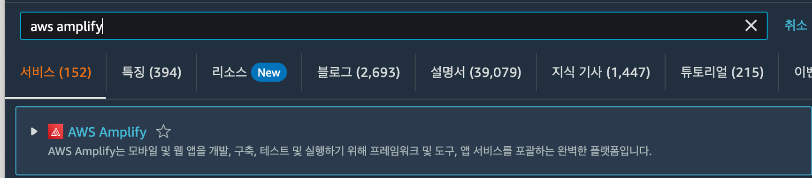
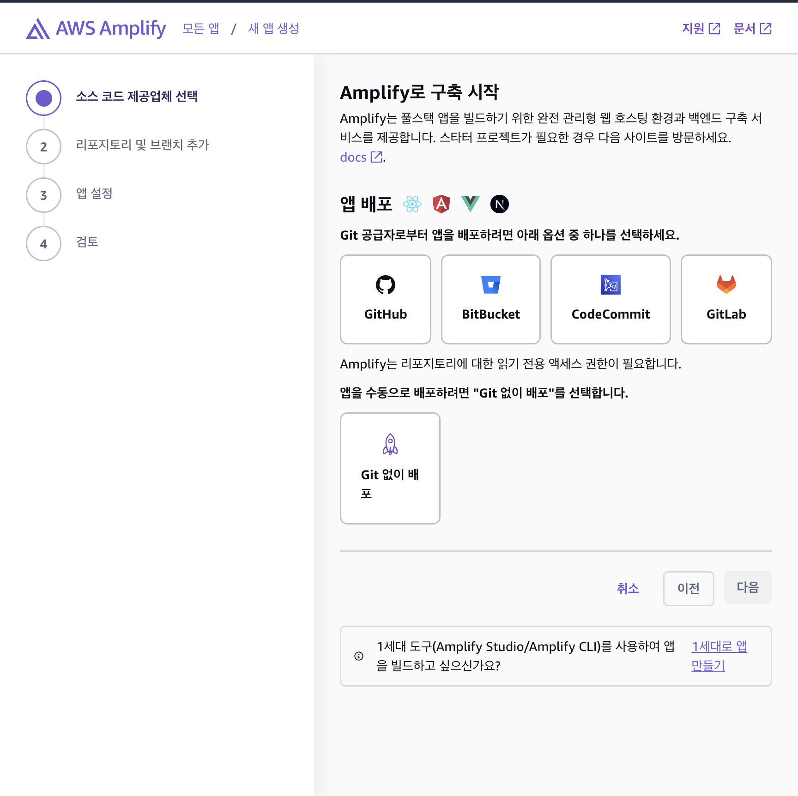
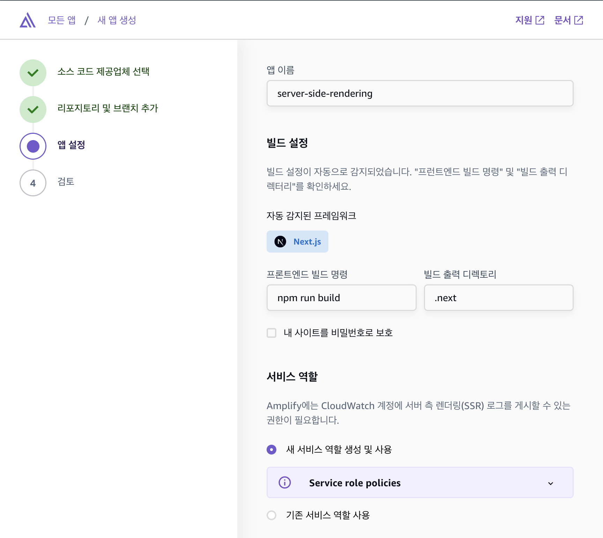
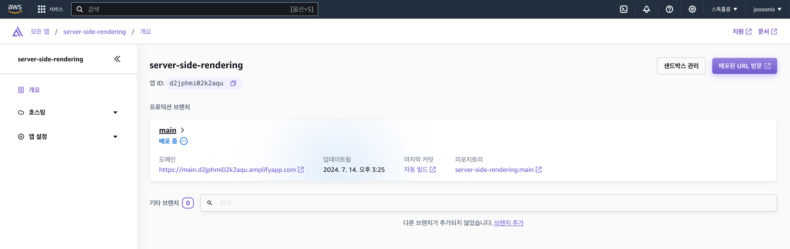
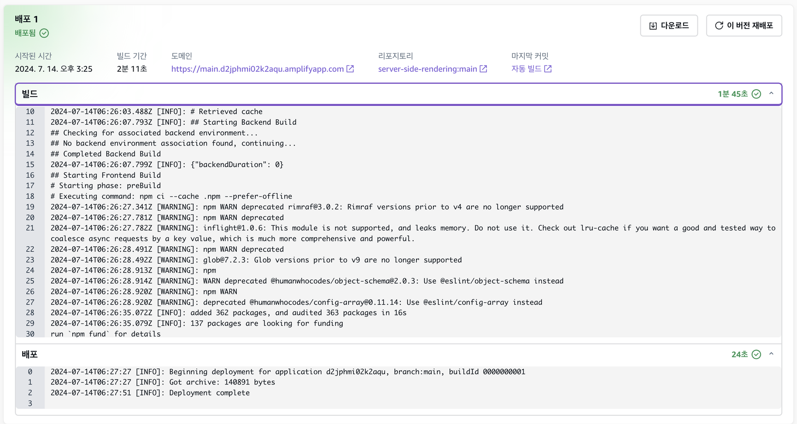
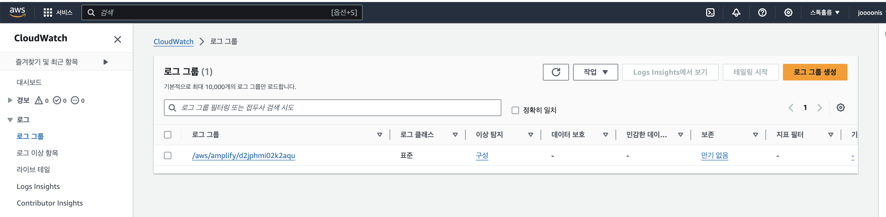
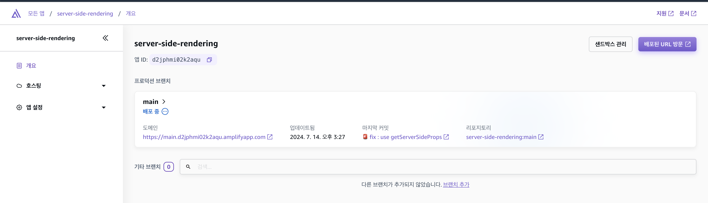
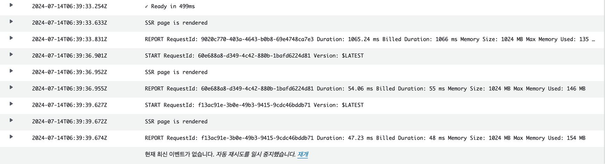
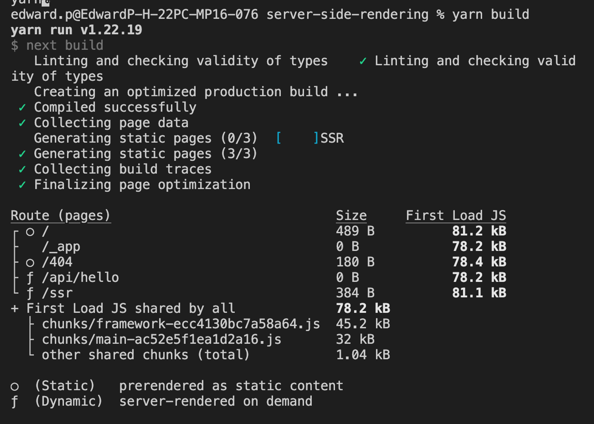

### SSR을 위한 리액트 API

**renderToString**

인수로 넘겨받은 리액트 컴포넌트를 렌더링해 HTML 문자열로 반환합니다.

이때 결과물에는 useEffect같은 훅과 이벤트 핸들러는 포함되지 않습니다. 브라우저가 최초에 렌더링에 필요한 HTML 템플릿을 생성하고 이러한 클라이언트 사이드에서 실행되어야 하는 자바스크립트 코드는 hydrate에 역할을 위임합니다. data-reactroot을 마크업에 포함시켜 이후 hydrate 함수가 루트를 식별하는 기준점을 붙여줍니다.

**renderToStaticMarkup**

renderToString과 동일하지만 data-reactroot를 미포함합니다. 순수한 HTML을 만들때 사용됩니다. 브라우저 액션이 없는 정적인 Web 생성시 용이합니다.

**renderToNodeStream**

브라우저 환경이 아닌 Node.js 환경에서만 사용가능하며 그 결과물이 문자열(string)이 아니라 ReadableStream이다. 이든 utf-8로 인코딩된 바이트 스트림으로 Node.js 환경에서만 사용할 수 있다.

스트림은 큰 데이터를 다룰 때 이를 청크(chunk) 단위로 분할해 사용한다. 이는 스트림을 활용해서 큰 크기의 데이터를 다룰때 서버의 부담을 줄일 수 있게 된다. 대부분의 리액트 서버 사이드 렌더링 프레임워크들은 renderToNodeStream을 채택하고 있다.

**renderToStaticNodeStream**

renderToNodeStream의 renderToStaticMarkup 버전이다.

**hydrate**

renderToString, renderToNodeStream으로 생성된 HTML 문자열에 자바스크립트 핸들러나 이벤트를 붙이는 역할을 한다. hydrate 이후에 사용자는 페이지와 인터랙션이 가능하게 된다.

### Next.js SSR 앱 배포하기

사용가능한 수단 : Vercel, Netlify, AWS Amplify, AWS ECS…

Vercel, Netlify, AWS Amplify

- zero-config로도 손쉽게 배포 가능

AWS Amplify

- AWS Amplify 호스팅은 S3와 CloudFront를 사용하여 비용이 발생합니다.
- Lambda, API Gateway, DynamoDB 등 AWS에서 제공하는 서버리스 서비스를 추가적으로 사용할 수 있습니다.
- 사용한 만큼 지불하는 모델로 초기 비용 부담이 적습니다.
- 복잡한 백엔드 서비스가 필요할 시 다른 AWS 서비스와 통합하여 전체 비용을 최적화할 수 있습니다.

Vercel, Netlify

- 개인 개발자와 소규모 프로젝트에 적합한 무료 플랜을 제공합니다.
- Organization의 경우 유료플랜밖에 존재하지 않습니다.
- 대규모 프로젝트의 경우 비용이 빠르게 증가할 수 있습니다.
- Vercel의 경우 한국 CDN이 존재해서 특정 지역에서 Netlify 보다 빠르다고 합니다.

AWS ECS (Elastic Container Service)

AWS ECS(Elastic Container Service)는 컨테이너화된 애플리케이션을 배포, 관리, 확장하는 서비스입니다. AWS Amplify, Vercel, Netlify와 비교하면, ECS는 더 높은 수준의 유연성과 제어를 제공하지만, 설정과 관리가 더 복잡할 수 있습니다.

### Next.js SSR 실습 앱 만들기

실습을 위해 페이지별로 CSR, SSR을 사용하는 next.js 앱을 만들어서 github 레포에 올렸습니다.

CSR 페이지

`useEffect`를 사용하여 영화정보를 fetch 해오고 불러오는 동안 ...loading이 화면에 표시됩니다.

```tsx
import Link from "next/link";
import React from "react";

interface Movie {
  userId: number;
  id: number;
  title: string;
  body: string;
}

export default function CSR() {
  React.useEffect(() => {
    const fetchData = async () => {
      const res = await fetch("http://jsonplaceholder.typicode.com/posts/1");
      const data = await res.json();
      setMovie(data);
    };
    fetchData();
  }, []);

  const [movie, setMovie] = React.useState<Movie>();

  return (
    <div>
      <h1>this is CSR Page</h1>

      {movie ? (
        <>
          <h3>{movie.title}</h3>
          <pre>{movie.body}</pre>
        </>
      ) : (
        <>...loading</>
      )}
      <Link href="/ssr">Go to SSR page</Link>
    </div>
  );
}
```

SSR 페이지

`GetStaticProps` 를 사용해서 data fetch를 서버에서 수행하는 SSR 페이지 입니다.

서버에서 콘솔이 찍히는지 확인하기 위해 console.log를 서버코드에 포함합니다.

```tsx
import { GetStaticProps } from "next";
import Link from "next/link";

interface Props {
  userId: number;
  id: number;
  title: string;
  body: string;
}

export default function SSR({ title, body }: Props) {
  return (
    <div>
      <h1>this is SSR Page</h1>
      <h6>{title}</h6>
      <pre>{body}</pre>
      <Link href="/">Go to CSR page</Link>
    </div>
  );
}

export const getStaticProps: GetStaticProps<Props> = async () => {
  const res = await fetch("http://jsonplaceholder.typicode.com/posts/1");
  const data: Props = await res.json();
  console.log("SSR page is rendered");
  return {
    props: data,
  };
};
```

로컬에서 확인

CSR 페이지 에서는 …loading이 잠깐 보이고 SSR 페이지로 이동시 서버에 console.log가 출력됩니다.

### AWS Amplify로 배포 실습

1. AWS 계정 생성
2. AWS Amplify 선택



3. Github 저장소에서 레포지토리를 선택하면 자동으로 프레임워크를 감지하고 빌드 명령을 가져옵니다.
   
   

4. 배포 시작

최초 배포시 리전 설정등이 2-5분 정도 선행되고 이후에 재클릭시 배포가 시작됩니다.


5. 배포 완료

배포과정에 총 2분 11초 소요되었습니다.


SSR 페이지에서 서버 콘솔이 잘 찍히는지 확인합니다.

AWS CloudWatch > 로그 > 로그그룹



`getStaticProps`을 사용해서 서버 콘솔이 찍히지 않습니다. `getServerSideProps` 로 SSR 페이지를 수정하고 다시 배포합니다.

`getStaticProps` 은 빌드시점에 실행되고 `getServerSideProps` 은 해당 함수가 정의되어 있는 라우터 페이지 진입전에 서버에서 실행됩니다. `getStaticProps` 는 정적인 페이지만 보여줄 수 있으므로 당연히 더 빠릅니다.

```tsx
import Link from "next/link";

interface Props {
  movie: {
    userId: number;
    id: number;
    title: string;
    body: string;
  };
}

export default function SSR({ movie }: Props) {
  return (
    <div>
      <h1>this is SSR Page</h1>
      <h6>{movie.title}</h6>
      <pre>{movie.body}</pre>
      <Link href="/">Go to CSR page</Link>
    </div>
  );
}

export const getServerSideProps = async () => {
  const res = await fetch("http://jsonplaceholder.typicode.com/posts/1");
  const data: Props = await res.json();
  console.log("SSR page is rendered");
  return {
    props: {
      movie: data,
    },
  };
};
```

main으로 푸시하니 자동으로 배포가 진행됩니다..!

배포완료후 CloudWatch에서 서버콘솔이 찍히는것을 확인 되었습니다


### Refs

https://graphite.dev/blog/why-we-use-aws-instead-of-vercel

https://www.youtube.com/watch?v=Z6SzB1U544s

https://f-lab.kr/insight/frontend-deployment-strategy

https://f-lab.kr/insight/docker-frontend-deployment

next 14.2.5 버전에서 빌드 결과물

책에서는 Server, Static으로 분류되었지만 latest 버전에서는 Static, Dynamic으로 분류된다.

\*pages router 사용



\*more options : EC2 + CloudFront
