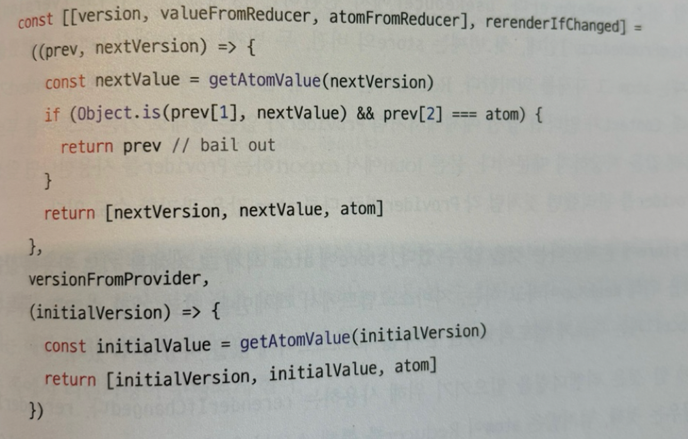

## 리액트와 상태관리 라이브러리

context API는 상태관리를 위한 도구가 아니라 상태를 주입하는 도구입니다.

상태 관리 라이브러리가 되기위해서는 아래 두가지를 최소한 충족해야 합니다.

1. 어떠한 상태를 기반으로 다른 상태를 만들어 낼 수 있어야 한다.
2. 필요에 따라 이러한 상태 변화를 최적화할 수 있어야 한다.

context API는 둘 중 어느것도 하지 못합니다. 댠순히 props 값을 하위로 전달해줄 뿐 하위 컴포넌트의 렌더링을 막지 못한다.

리덕스 이후의 상태관리 라이브러리의 특징은 훅을 확용해 작은 크기의 상태를 효율적으로 관리한다는 점이다.

### React hooks을 통한 상태관리

useState, useReducer를 사용하여 사용자 정의 훅을 만들고 상태관리에 관한 로직을 컴포넌트에서 분리한다.

다만 사용처에 따라 다른 상태를 반환하는 지역상태라는 단점?이 여전히 있다.

```tsx
import { useState } from "react";

function useCounter(initCoute = 0) {
  const [count, setCount] = useState(initCoute);
  const increment = () => setCount(count + 1);
  const decrement = () => setCount(count - 1);
  return { count, increment, decrement };
}

export default useCounter;
```

전역 상태관리 라이브러리들은 결국 아래 두가지를 각자의 방식으로 해결하고 있다.

1. useState, useReducer는 컴포넌트 내부에서만 사용할 수 있는 지역상태이므로 외부 어딘가에 상태를 둔다.
2. 그리고 이 상태의 변경을 감지하여 이를 참조하는 컴포넌트에 렌더링을 일으킨다.

### Recoil, Jotai, Zustand

recoil, jotai는 Context, Provider 그리고 훅을 기반으로 가능한 작은 상태를 효율적으로 관리하는데에 초점을 두고 있다.

Zustand는 반면 Redux와 비슷하게 하나의 큰 스토어를 기반으로 상태를 관리하며 Context가 아니라 클로저를 기반으로 이 상태를 관리한다.

### Jotai

Jotai는 Recoil의 atom 모델에 영감을 받아 만들어진 상태관리 라이브러리로 상향식(bottom-up) 접근 방식을 취하여 Redux처럼 하나의 큰 상태를 애플리케이션에 내려주는 방식이 아니라

### atom

https://github.com/pmndrs/jotai/blob/main/src/vanilla/atom.ts

```tsx
import { createContext, createElement, useContext, useRef } from "react";
import type { FunctionComponentElement, ReactNode } from "react";
import { createStore, getDefaultStore } from "../vanilla.ts";

type Store = ReturnType<typeof createStore>;

type StoreContextType = ReturnType<typeof createContext<Store | undefined>>;
const StoreContext: StoreContextType = createContext<Store | undefined>(
  undefined
);

type Options = {
  store?: Store;
};

export const useStore = (options?: Options): Store => {
  const store = useContext(StoreContext);
  return options?.store || store || getDefaultStore();
};

export function atom<Value, Args extends unknown[], Result>(
  read: Value | Read<Value, SetAtom<Args, Result>>,
  write?: Write<Args, Result>
) {
  const key = `atom${++keyCount}`;
  const config = {
    toString: () => key,
  } as WritableAtom<Value, Args, Result> & { init?: Value };
  if (typeof read === "function") {
    config.read = read as Read<Value, SetAtom<Args, Result>>;
  } else {
    config.init = read;
    config.read = defaultRead;
    config.write = defaultWrite as unknown as Write<Args, Result>;
  }
  if (write) {
    config.write = write;
  }
  return config;
}
```

내부에서 키를 만들기 때문에 atom 함수에 별도로 키를 넘겨주지 않아도 된다. init, read, write을 가지는 config 객체를 return하고 있고 상태는 별도로 저장하지 않는다. 상태는 store에서 관리한다. Store 타입이 createStore 함수의 return 타입으로 정의되어 있으니 createStore 구현부로 가봅시다.

### store

https://github.com/pmndrs/jotai/blob/628aa3e8061415a822fd837c540957d7e79c9636/src/vanilla/store.ts#L53

createStore 구현부가 꽤나 길어서 (268~721 line) 몇가지만 책 내용을 확인차 보면 WeakMap으로 atom 객체 자체를 키로 상태를 관리하고 있습니다.

```tsx
...
export const createStore = (): Store => {
  const atomStateMap = new WeakMap<AnyAtom, AtomState>()
  // for debugging purpose only
  let debugMountedAtoms: Set<AnyAtom>

  if (import.meta.env?.MODE !== 'production') {
    debugMountedAtoms = new Set()
  }

  const getAtomState = <Value>(atom: Atom<Value>) => {
    let atomState = atomStateMap.get(atom) as AtomState<Value> | undefined
    if (!atomState) {
      atomState = { d: new Map(), p: new Set(), n: 0 }
      atomStateMap.set(atom, atomState)
    }
    return atomState
  }

...
```

### Provider

https://github.com/pmndrs/jotai/blob/628aa3e8061415a822fd837c540957d7e79c9636/src/react/Provider.ts

Provider 에서 storeRef를 주입해주고 있습니다. useRef를 사용하기 때문에 Provider에 props로 넘겨주는 store에 변경이 일어나도 하위 컴포넌트에서 리렌더링이 일어나지 않는다.

```tsx
export const Provider = ({
  children,
  store,
}: {
  children?: ReactNode;
  store?: Store;
}): FunctionComponentElement<{ value: Store | undefined }> => {
  const storeRef = useRef<Store>();
  if (!store && !storeRef.current) {
    storeRef.current = createStore();
  }

  // const element = createElement(type, props, ...children)
  return createElement(
    StoreContext.Provider,
    {
      value: store || storeRef.current,
    },
    children
  );
};
```

vs. 책

상당히 비슷하다.

```tsx
import { PropsWithChildren, useRef } from "react";

export const CouterStoreContext = createContext<Store<CounterStore>>(
  createStore<CounterStore>({ count: 0, text: "hello" })
);

export const CounterStoreProvider = ({
  initialState,
  children,
}: PropsWithChildren<{
  initialState: CounterStore;
}>) => {
  const storeRef = useRef<Store<CounterStore>>();

  if (!storeRef.current) {
    storeRef.current = createStore(initialState);
  }

  return (
    <CounterStoreContext.Provider value={storeRef.current}>
      {children}
    </CounterStoreContext.Provider>
  );
};
```

### useAtomValue

https://github.com/pmndrs/jotai/blob/main/src/react/useAtomValue.ts

```tsx
/// <reference types="react/experimental" />

import ReactExports, { useDebugValue, useEffect, useReducer } from "react";
import type { ReducerWithoutAction } from "react";
import type { Atom, ExtractAtomValue } from "../vanilla.ts";
import { useStore } from "./Provider.ts";

type Store = ReturnType<typeof useStore>;

// PromiseLike 타입인지 확인하는 타입가드
const isPromiseLike = (x: unknown): x is PromiseLike<unknown> =>
  typeof (x as any)?.then === "function";

// React 19에서 추가되는 use hook
const use =
  ReactExports.use ||
  (<T,>(
    promise: PromiseLike<T> & {
      status?: "pending" | "fulfilled" | "rejected";
      value?: T;
      reason?: unknown;
    }
  ): T => {
    if (promise.status === "pending") {
      throw promise;
    } else if (promise.status === "fulfilled") {
      return promise.value as T;
    } else if (promise.status === "rejected") {
      throw promise.reason;
    } else {
      promise.status = "pending";
      promise.then(
        (v) => {
          promise.status = "fulfilled";
          promise.value = v;
        },
        (e) => {
          promise.status = "rejected";
          promise.reason = e;
        }
      );
      throw promise;
    }
  });

type Options = Parameters<typeof useStore>[0] & {
  delay?: number;
};

// Function Overloading, 함수 오버로드 시그니처
export function useAtomValue<Value>(
  atom: Atom<Value>,
  options?: Options
): Awaited<Value>;

// Function Overloading, 함수 오버로드 시그니처
export function useAtomValue<AtomType extends Atom<unknown>>( // AtomType, generic으로 사용
  atom: AtomType,
  options?: Options
): Awaited<ExtractAtomValue<AtomType>>;

// 실제 함수 구현부
export function useAtomValue<Value>(atom: Atom<Value>, options?: Options) {
  const store = useStore(options);

  // const [state, dispatch] = useReducer(reducer, initialArg, init?)
  // 순서대로 atom을 store에서 get한 값, store, atom
  const [[valueFromReducer, storeFromReducer, atomFromReducer], rerender] = // dispatch를 사용하여 rerendering을 일으킴
    useReducer<
      ReducerWithoutAction<readonly [Value, Store, typeof atom]>,
      undefined
    >(
      (prev) => {
        const nextValue = store.get(atom);
        if (
          Object.is(prev[0], nextValue) && // atom value는 Object.is로 비교
          prev[1] === store && // store, atom 자체는 객체의 참조를 비교
          prev[2] === atom
        ) {
          return prev;
        }
        return [nextValue, store, atom];
      },
      undefined,
      () => [store.get(atom), store, atom]
    );

  let value = valueFromReducer;
  if (storeFromReducer !== store || atomFromReducer !== atom) {
    // 넘겨받은 atom이 스토어에 있는 atom과 달라지는 경우 atom의 값이 어디에서 사용되더라도 useAtomValue를 사용하는 쪽에서는 rerendering이 일어남
    rerender();
    value = store.get(atom);
  }

  const delay = options?.delay;
  useEffect(() => {
    const unsub = store.sub(atom, () => {
      if (typeof delay === "number") {
        // delay 로직
        // delay rerendering to wait a promise possibly to resolve
        setTimeout(rerender, delay);
        return;
      }
      rerender();
    });
    rerender();
    return unsub;
  }, [store, atom, delay]); // atom이 변경되면 리렌더링을 일으킨다.

  useDebugValue(value);
  // TS doesn't allow using `use` always.
  // The use of isPromiseLike is to be consistent with `use` type.
  // `instanceof Promise` actually works fine in this case.
  return isPromiseLike(value) ? use(value) : (value as Awaited<Value>);
}
```

책과는 다르게 React 19에서 추가될 use 함수를 사용하여 Promise로 이루어진 상태를 관리합니다. use를 제공하지 않는 경우 커스텀 use를 사용합니다.

책에는 useReducer 호출이 빠져있습니다..



\*PromiseLike 타입?

- PromiseLike: `then` 메서드만 지원하는 타입.
- Promise: `then`, `catch`, `finally` 메서드를 모두 지원하는 타입.

PromiseLike 타입은 Promise의 넓은 의미에서의 타입 적용을 위해 만들어진 타입입니다. 처음 Promise 개념이 등장했을 때는 `then` 메서드만을 지원하는 라이브러리가 많았습니다.

\*함수 오버로드(Function Overloading)

함수 오버로드(Function Overloading)는 여러 개의 함수 선언을 통해 하나의 함수가 다양한 매개변수 목록과 반환 타입을 가질 수 있도록 하는 기능입니다.

1. 여러 개의 함수 선언부(오버로드 시그니처)
2. 실제 함수 구현부

로 이루어집니다.

\*`WeakMap`는 JavaScript와 TypeScript에서 사용할 수 있는 객체로, 키로 객체를 사용하고 값으로는 임의의 값을 가질 수 있는 Map 자료구조 입니다.

### Zustand

Jotai가 Recoil에 영감을 받아 만들어졌다면 Zustand는 리덕스에 영감을 받아 만들어졌다. atom이라는 개념으로 최소 단위의 상태를 관리하는 것이 아니라 하나의 스토어를 중앙 집중형으로 사용해 이 내부에서 상태를 관리하고 있습니다.

### zustad store

https://github.com/pmndrs/zustand/blob/main/src/vanilla.ts

```tsx
const createStoreImpl: CreateStoreImpl = (createState) => {
  type TState = ReturnType<typeof createState>
  type Listener = (state: TState, prevState: TState) => void
  let state: TState
  const listeners: Set<Listener> = new Set()

  const setState: StoreApi<TState>['setState'] = (partial, replace) => {
    // TODO: Remove type assertion once https://github.com/microsoft/TypeScript/issues/37663 is resolved
    // https://github.com/microsoft/TypeScript/issues/37663#issuecomment-759728342
    const nextState =
      typeof partial === 'function'
        ? (partial as (state: TState) => TState)(state)
        : partial
    if (!Object.is(nextState, state)) {
      const previousState = state
      state =
        replace ?? (typeof nextState !== 'object' || nextState === null)
          ? (nextState as TState)
          : Object.assign({}, state, nextState)
      listeners.forEach((listener) => listener(state, previousState))
    }
  }

  const getState: StoreApi<TState>['getState'] = () => state

  const getInitialState: StoreApi<TState>['getInitialState'] = () =>
    initialState

  const subscribe: StoreApi<TState>['subscribe'] = (listener) => {
    listeners.add(listener)
    // Unsubscribe
    return () => listeners.delete(listener)
  }

  const destroy: StoreApi<TState>['destroy'] = () => {
    if (import.meta.env?.MODE !== 'production') {
      console.warn(
        '[DEPRECATED] The `destroy` method will be unsupported in a future version. Instead use unsubscribe function returned by subscribe. Everything will be garbage-collected if store is garbage-collected.',
      )
    }
    listeners.clear()
  }

  const api = { setState, getState, getInitialState, subscribe, destroy }
  const initialState = (state = createState(setState, getState, api))
  return api as any
}

...
export const createStore = ((createState) =>
  createState ? createStoreImpl(createState) : createStoreImpl) as CreateStore

```

`state` 라는 변수에 스토어의 상태값을 보관하고 클로저의 최신값을 가져오는 getState는 함수로 작성되어 있습니다.

바닐라 자바스크립트로 작성되어 있어서 리액트에서 사용하기 위해서는 추가적인 API 구현이 필요한데 `useSyncExternalStoreWithSelector`라는 리액트 18에 추가된 useSyncExternalStore라는 리액트 API를 기반으로 하는 유틸리티 훅으로 외부 저장소를 구독할 수 있게 해준다.

https://www.npmjs.com/package/use-sync-external-store

https://github.com/pmndrs/zustand/blob/main/src/react.ts

```tsx
export function useStore<TState, StateSlice>(
  api: WithReact<ReadonlyStoreApi<TState>>,
  selector: (state: TState) => StateSlice = identity as any,
  equalityFn?: (a: StateSlice, b: StateSlice) => boolean
) {
  if (
    import.meta.env?.MODE !== "production" &&
    equalityFn &&
    !didWarnAboutEqualityFn
  ) {
    console.warn(
      "[DEPRECATED] Use `createWithEqualityFn` instead of `create` or use `useStoreWithEqualityFn` instead of `useStore`. They can be imported from 'zustand/traditional'. https://github.com/pmndrs/zustand/discussions/1937"
    );
    didWarnAboutEqualityFn = true;
  }
  const slice = useSyncExternalStoreWithSelector(
    api.subscribe,
    api.getState,
    api.getServerState || api.getInitialState,
    selector,
    equalityFn
  );
  useDebugValue(slice);
  return slice;
}
```

추가적인 상태관리 라이브러리 옵션 :

Xstate, Constate…
