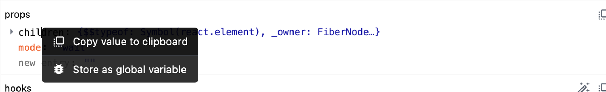
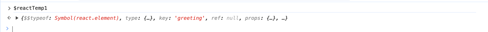
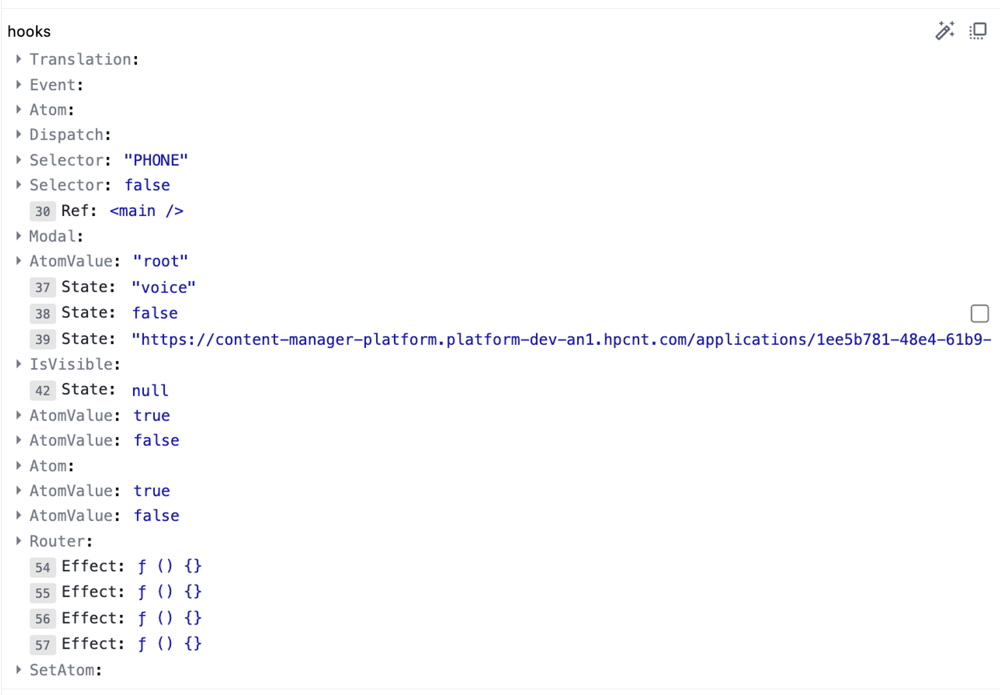
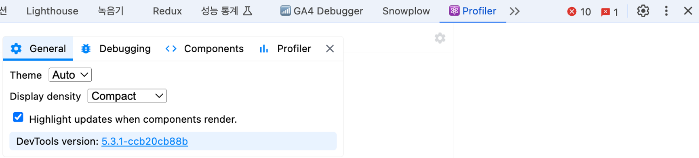
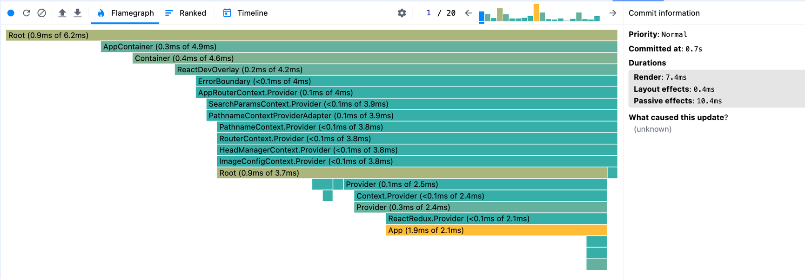
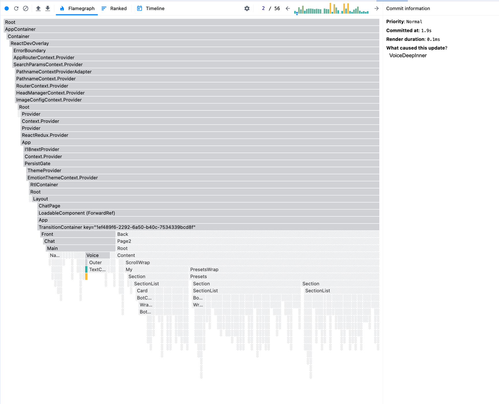
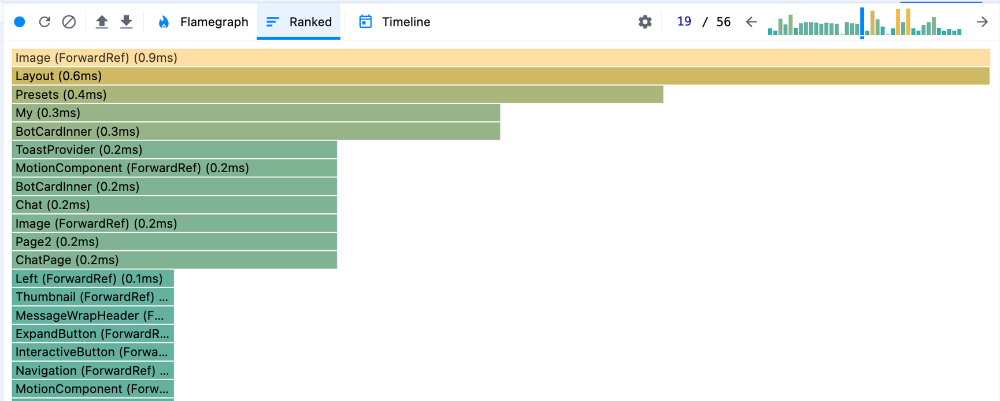
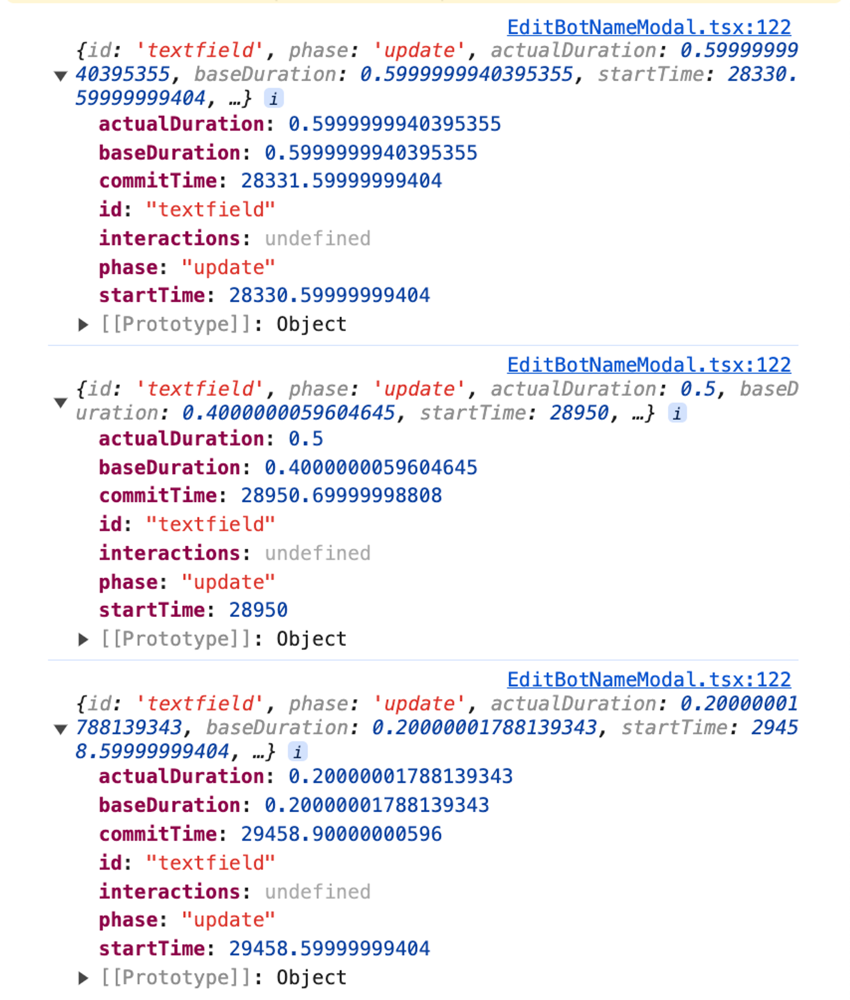

### **React Developer Tools**

https://react.dev/learn/react-developer-tools

Chrome에 위 리액트 개발 도구 설치시에 크롬 개발자 도구에 `Components`, `Profiler` 두 도구가 추가됩니다.

### Components

`Components` 를 통해 리액트 애플리케이션 전체 컴포넌트의 트리구조를 확인할 수 있습니다.

이때 무기명 함수의 경우 디버깅에 어려움이 있을 수 있으니 컴포넌트 정의 시에 함수를 기명으로 두는 것이 디버깅하는데에 용이합니다.

만약 기명으로 쓰기에 어려움이 있다면 displayName을 지정하는게 도움이 됩니다. (HOC 사용시에 유용합니다.)

단 production에서는 컴포넌트 이름에 난수화를 거치는 경우가 많아서 개발모드에서만 제한적으로 참고하는 것이 좋습니다.

컴포넌트 별로 props, hooks를 확인할 수 있습니다.

### props

props 값을 가져와서 콘솔에 볼 수 있습니다.





### hooks

hook 정보는 아래와 같습니다.

useState, useEffect등의 경우 use가 생략되고

useEffect에 익명함수로 적을 경우 f () {} 와 같이 표시됩니다.



### Profiler

프로파일러는 리액트가 렌더링하는 과정에서 발생하는 상황을 확인하기 위한 도구입니다.

\*디버깅 시에는 Highlight updates when components render 체크 해줍시다.


실제로 프로파일링 해보고 어떤 정보들을 가져올 수 있는지 결과를 확인해보겠습니다.


프로파일링 동안 20번의 렌더 커밋(1/20)이 이루어졌습니다. Flamegraph 탭에서 각 커밋마다 렌더링한 컴포넌트의 관련 정보를 볼 수 있습니다.

Flamegraph에서는 리액트 트리 구조대로 렌더링 소요시간을 보여주고 있습니다. Root(0.9ms of 6.2ms)은 해당 컴포넌트의 총 렌더링 시간은 6.2ms이고 (이는 하위 컴포넌트의 렌더링 시간을 포함합니다.) 해당 컴포넌트의 렌더링에는 0.9ms가 소비되었음을 의미합니다.

특정 커밋에서 렌더링이 일어나지 않는 컴포넌트들은 회색으로 표시됩니다.


Ranked 탭에서는 해당 커밋에서 렌더링 소요시간이 긴 순서대로 정렬됩니다. (해당 커밋에서 렌더링에 포함되지 않는 컴포넌트는 제외합니다.)



### Profiler - React

https://react.dev/reference/react/Profiler

개발도구 외에도 리액트에서 제공하는 `<Profiler/>` 를 통해 디버깅이 가능합니다. `onRender` 함수는 아래와 같은 타입입니다.

```tsx
<Profiler id="App" onRender={onRender}>
  <AnyComponent />
</Profiler>
```

```tsx
type ProfilerOnRenderCallback = (
  id: string,
  phase: "mount" | "update",
  actualDuration: number,
  baseDuration: number,
  startTime: number,
  commitTime: number,
  interactions: Set<SchedulerInteraction>
) => void;
```

onRender 함수 단순히 호출해본 결과


